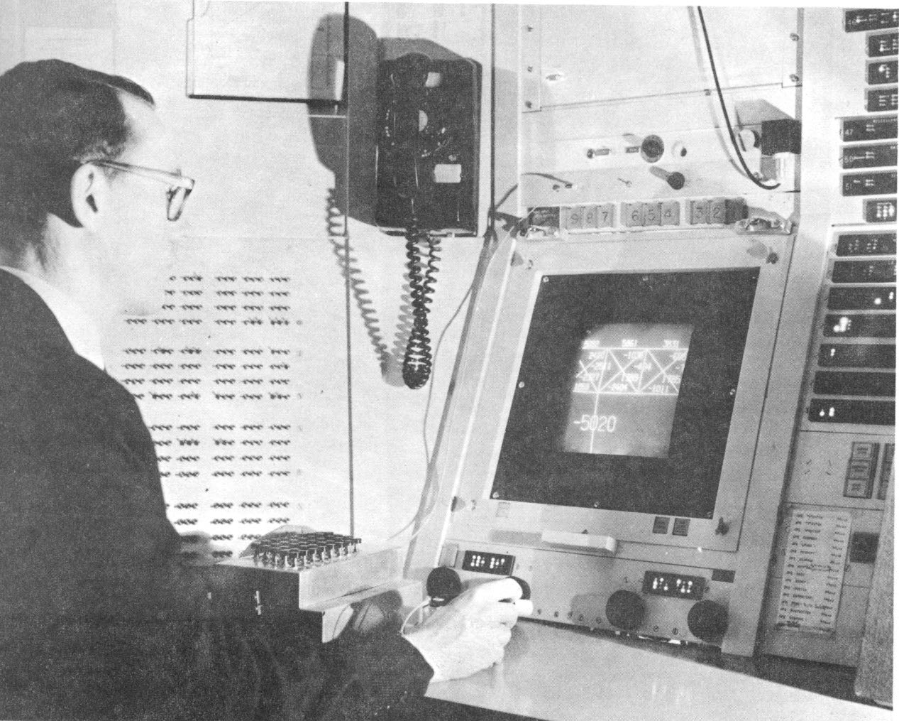
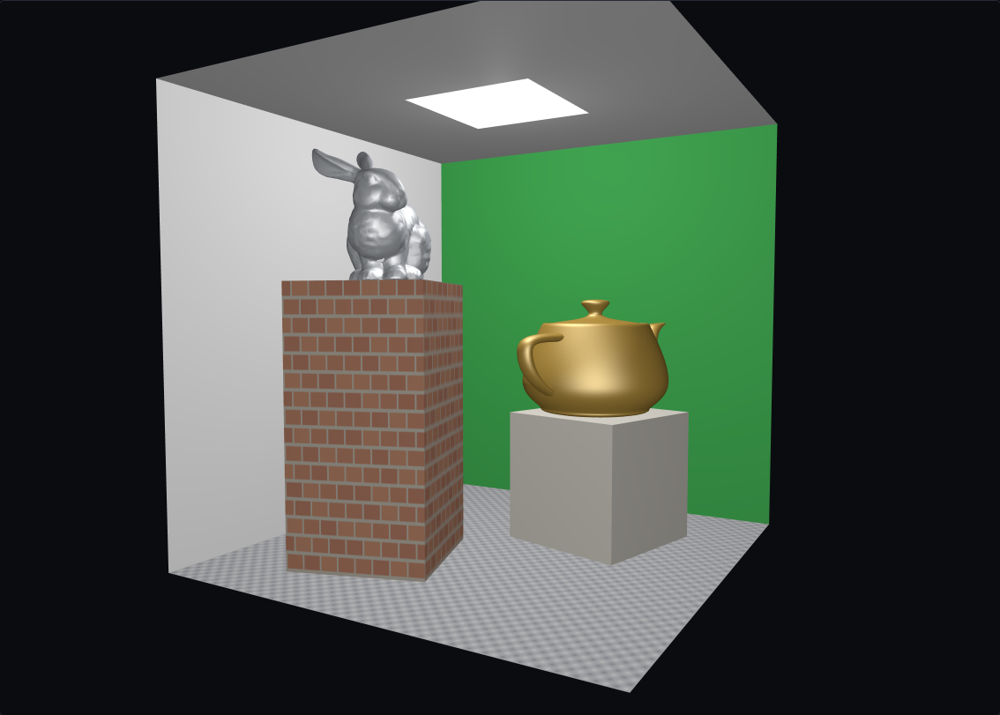
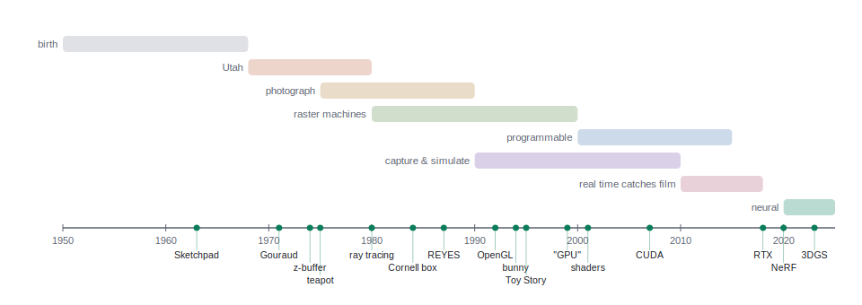
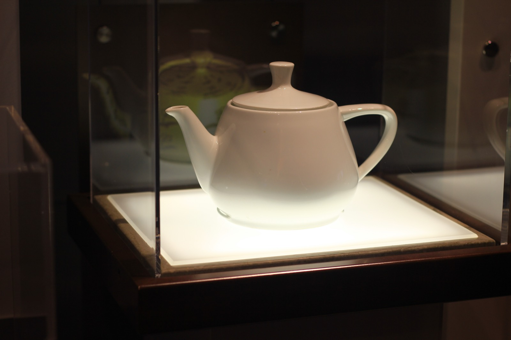
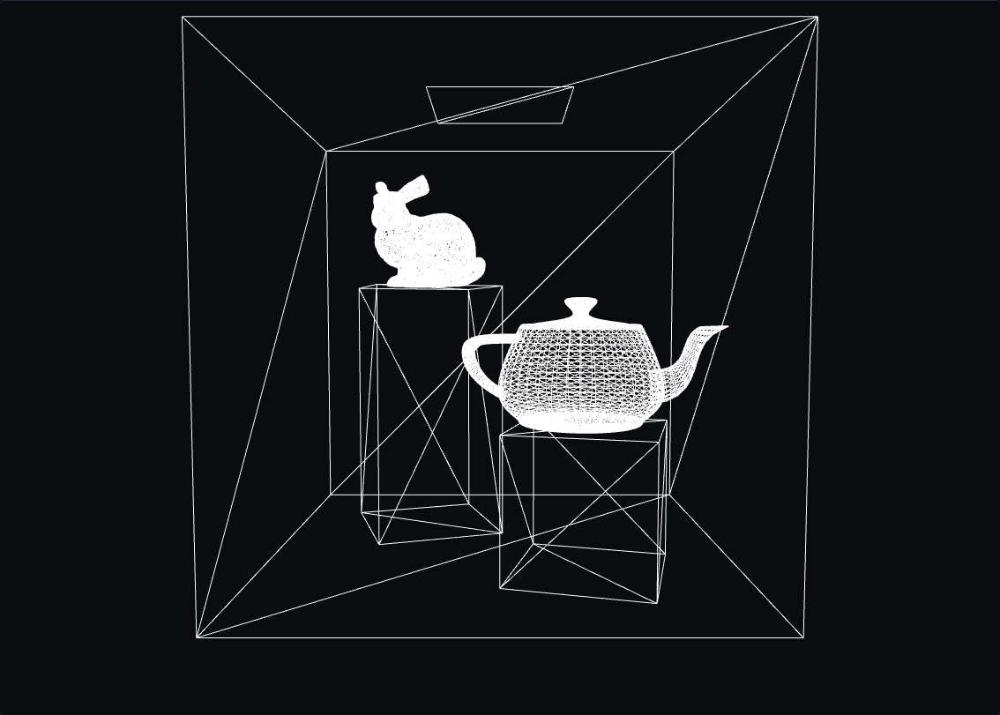
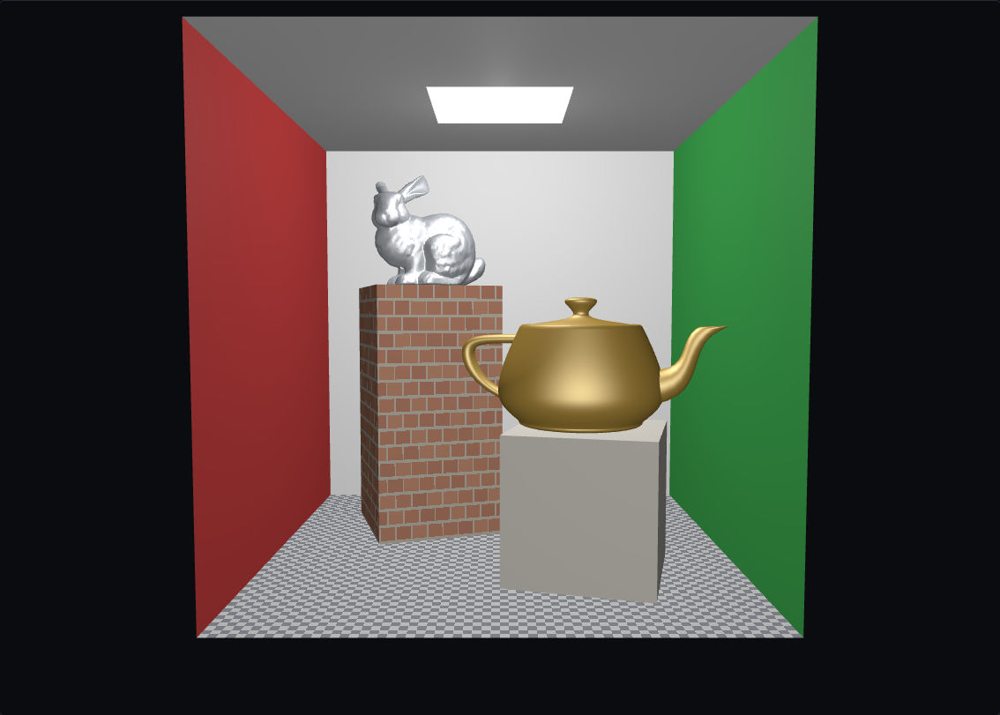
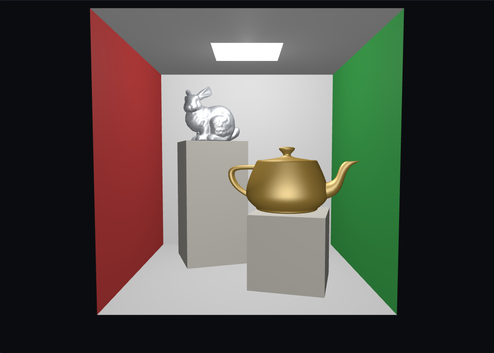
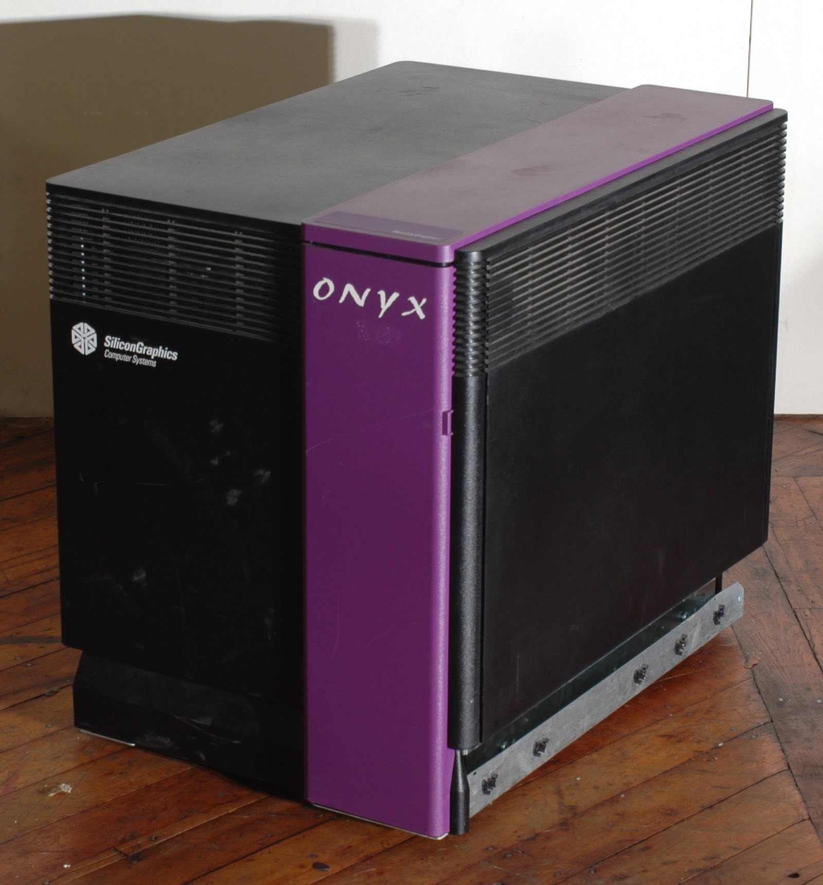
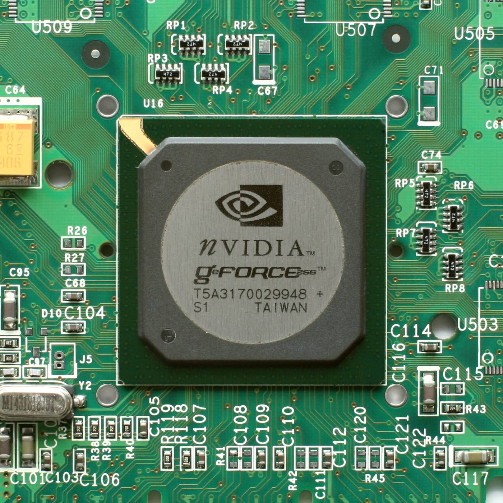
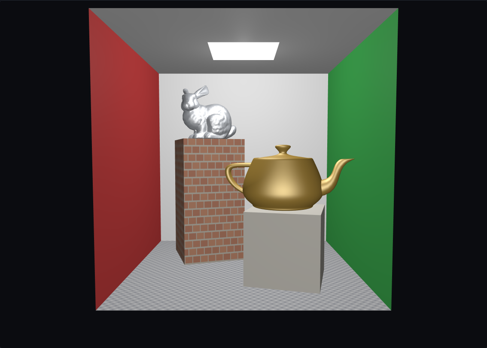

<!--
  CSS 551 · Lecture 1 (Session 1) — 3D Computer Graphics: The Big Picture.
  A story-driven, informal overview of the WHOLE field. v3 restructure: the
  deck now walks the SAME historic spine as the Chapter 1 handout — seventy-
  five years in eight overlapping eras, 1950 → today, in chronological order:
      1 interactive pictures born (1950-68)   5 the programmable era (2000-15)
      2 the Utah school (1968-80)             6 capturing & simulating (1990-2010)
      3 chasing the photograph (1975-90)      7 real time catches film (2010-18)
      4 the raster machines (1980-2000)       8 the neural era (2020-)
  + a "map of the field today" close. Each concept and each live demo is homed
  in the era that made it the point; where a technique was invented earlier
  than it became ubiquitous, we teach it where the handout gives it weight and
  name its origin in passing. The running example is "our scene" — a modified
  Cornell box (red left / green right / white elsewhere; a brick-textured tall
  box topped by the Stanford bunny and a short box topped by the Newell teapot,
  no sphere; a checker floor at the textured stage; one ceiling light) that threads
  through the eras: it renders LIVE in the Utah era (the our-scene demo) and
  checkpoints with pre-rendered stills as later eras add tricks. No math, no
  equations — scale facts (counts, times) are the only numbers. Every technical
  term is bolded exactly ONCE, at its introduction, then used plainly after.

  Live demos are PAIRS: a setup slide (what the demo shows + what to look for)
  followed by a full-slide exhibit whose first line is the reveal comment
      .slide: class="demo-full"
  holding ONLY a short ## title + the embed div (+ its viz-fallback pre).
  index.html's .demo-full CSS grows those embeds to ~520px viewports.

  reveal.js: FLAT deck — every slide is a top-level "---" section (no vertical
  "--" stacks). This keeps the verify-deck harness's demo probe correct: it
  selects "section.present [data-demo]", which inside a vertical stack matches
  a demo on a not-yet-shown sibling slide (0x0 -> fill times out) and can also
  mis-count the walk. Flat = one section per slide = only matched when shown.
  S02-S10 copy this: keep decks flat. Notes follow "Note:".

  MARKDOWN/KaTeX minefield (marked runs before KaTeX): never two "_" on one
  line; no <small> around math; this deck has NO math at all, on purpose —
  the informal register is the point. Verify every slide at 1280x620.

  DEMOS (12 embeds, all registry slugs, embed stage; each a setup+demo-full
  PAIR), now homed by era:
   - Era 2 (Utah): data-demo="mesh-view"     data-controls="wire,spin"
                   data-demo="scene-graph"    data-controls="baseRy,armBend"
                   data-demo="projection"     data-controls="fov"
                   data-demo="raster"         data-controls="res,angle"
                   data-demo="illumination"   data-controls="lightAz,lightEl"
                   data-demo="our-scene"      data-controls="stage,lightX"
   - Era 4 (raster machines): data-demo="raster"  data-controls="res,aa"
   - Era 5 (programmable):    data-demo="uv-placement" data-controls="offU,tile"
                              data-demo="bump-map"     data-controls="bump,lightAz"
   - Era 6 (capture): data-demo="lod"       data-controls="level,dist"
                      data-demo="keyframe"   data-controls="t,ease"
   - Era 8 (neural):  data-demo="gsplat"    data-controls="fov"
              (fov slider so the verify-deck pixel probe has a control to
               drive; the scene itself needs none)
  Readout/matrix cards are hidden by this deck's index.html for all demos
  EXCEPT lod, bump-map, mesh-view, and our-scene, whose count readouts are
  scale facts and the point (overview register, no math on screen). The
  upgraded demos (mesh-view, lod, illumination, uv-placement, bump-map)
  carry a model-selector button row visible in embeds — Notes direct its
  live use (e.g. "switch to the bunny").

  SCENE STILLS: figures/scene-stage0..4.png + scene-hero.png are GENERATED
  by tools/gen-scene-shots.mjs (the our-scene demo rendered headless) —
  re-run the tool, never hand-edit the PNGs. scene-hero.png is an orbited
  angle with the RED wall out of frame; scene-stage4.png is the canonical
  dual-wall Cornell view. On the historic spine the stills are used as
  era checkpoints: stage0 (wireframe) + live stages 0-2 in Era 2; stage2
  (best local render) in Era 3's GI comparison; stage3 (textured) and
  stage4 (textured + clean edges) as the Era 5 capstone.

  FIGURES: sessions/S01-.../figures/*.svg are GENERATED — edit
  tools/gen-figures.mjs and re-run it, never the SVGs.
  MEDIA: ../../media/overview/*.jpg, all license-verified; on-slide credit
  lines are copied VERBATIM from media/overview/CREDITS.md — edit there first.
  The four history-era media (sketchpad, utah-teapot, sgi-workstation,
  geforce256) + gi-comparison anchor the era slides they belong to.
  READING: ../../handouts/ch01-intro-3d-graphics.html is the primary reading
  and the deck's spine — the era dividers deep-link its section ids
  (#era-birth, #era-utah, #era-photograph, #era-raster, #era-programmable,
  #era-capture, #era-realtime, #era-neural, #era-map). The opening timeline
  slide shows ../../handouts/figures/cg-timeline.svg.

  Session plan (120 min, Tue 5:45-7:45 PM synchronous online):
    0:00  Open (title, Sketchpad, the goal, pixels, our scene, timeline)  ~10 min
    0:10  Era 1  Interactive pictures born (1950-68)                        6 min
    0:16  Era 2  The Utah school (1968-80) — a world in numbers, taking     30 min
                 the picture, our scene live
    0:46  Era 3  Chasing the photograph (1975-90) — GI, offline light       12 min
    0:58  Era 4  The raster machines (1980-2000) — silicon, jaggies, AA     12 min
    1:10  Era 5  The programmable era (2000-15) — shaders, surfaces         14 min
                 that lie, PBR, our scene complete
    1:24  Era 6  Capturing & simulating (1990-2010) — scans, shapes,        18 min
                 LOD, motion & simulation
    1:42  Era 7  Real time catches film (2010-18) — the loop, games, VR      8 min
    1:50  Era 8  The neural era (2020-)                                      4 min
    1:54  Close  The map of the field / Thursday                            4 min
    1:58  end (+ buffer)
-->

## CSS 551

### Advanced 3D Computer Graphics

**Lecture 1 — 3D Computer Graphics: The Big Picture**

*Seventy-five years, one scene, start to finish.*

<small>Autumn 2026 · Tue 5:45–7:45 PM (online) · Dr. Marcel Gavriliu</small>

---

## It begins with a sketch


<small class="credit">Ivan Sutherland (scan: Kerry Rodden) · CC BY-SA 3.0 · via Wikimedia Commons</small>

**1963**: Ivan Sutherland's **Sketchpad** — a person draws directly on the screen with a **light pen**, and the machine answers.

---

## The goal, in one sentence

> **Synthesize** a 2D **image** of a 3D **scene**.

- *synthesize* — the picture is **computed**, not photographed
- that, whole, is the field of **computer graphics**
- the mirror-image field: computer vision *analyzes* images — we *make* them

---

## A screen is a grid of pixels


a **pixel** — *picture element* — is one little colored square of the grid

---

## A color is three numbers

- each pixel stores three numbers: **RGB** — red, green, blue intensities
- the **framebuffer** is the whole array in memory — a few million numbers
- the monitor repaints itself *from the framebuffer*, 60 times a second

So "drawing" — anything, ever — means one thing: **write numbers into the framebuffer.**

---

## Where those numbers show up

<div style="display: flex; gap: 14px; justify-content: center; align-items: flex-start;">
<div style="flex: 1 1 0; min-width: 0;"><small class="credit">© Blender Foundation | bigbuckbunny.org</small></div>
<div style="flex: 1 1 0; min-width: 0;"><small class="credit">U.S. Government · Public domain · via Wikimedia Commons</small></div>
<div style="flex: 1 1 0; min-width: 0;"><small class="credit">Franz A. Fellner · CC BY 4.0 · via Wikimedia Commons</small></div>
</div>

Games · film & VFX · CAD & engineering · medical imaging · scientific visualization · simulation & training

---

## Tonight, in order

**Eight eras, 1950 → today** — building **one small world**, a trick per era.

- **1950s–70s**: pictures born; Utah invents the pipeline
- **1980s–2000s**: chase the photo; silicon; programmable
- **1990s–now**: capture, simulate, real time, neural

<small>Thursday = studio (Unity). Reading: <a href="../../handouts/ch01-intro-3d-graphics.html">Chapter 1</a>.</small>

---

## Meet tonight's scene



A Cornell box, two colored walls. A gold teapot and the Stanford bunny, each on its box, one ceiling light.

**Watch it gain a trick every era — by the end you'll understand every choice in this picture.**

---

## Eight eras, one timeline



Tonight is this bar, left to right — the bands **overlap on purpose**: research eras hand results to hardware and keep going.

---

### Era 1 · Interactive pictures are born

<small>1950–1968 · ~6 min · <a href="../../handouts/ch01-intro-3d-graphics.html#era-birth">Chapter 1 §1</a></small>

---

## Drawing at the speed of thought

- **1951**: MIT's Whirlwind — the first computer fast enough to draw in *real time*, on a **vector display** (glowing lines, not filled shapes)
- **1963**: Sketchpad adds the light pen and a solver — *interactive* graphics is born
- the wall: hardware arithmetic — a few thousand line segments before flicker; **no filled, shaded surfaces yet**

---

## The Ultimate Display

**1965**, Sutherland's manifesto: the display is *"a looking glass into a mathematical wonderland."*

- not a window onto data — a *world* the computer controls
- **1968**: he builds the first head-mounted display — the **"Sword of Damocles,"** hung from the ceiling
- that idea comes back, as a product, fifty years from now on this timeline

---

### Era 2 · The Utah school

<small>1968–1980 · ~30 min · <a href="../../handouts/ch01-intro-3d-graphics.html#era-utah">Chapter 1 §2</a></small>

One department invented most of what a scene *is* — and how to take its picture.

---

## What's in a scene

A scene is a cast list, not a picture:

- **objects** — the walls, the two boxes, the teapot, the bunny
- a **camera** — the point of view the image will be made from
- **lights** — the ceiling lamp, without which every pixel is black

---

## A 3D thing is a mesh of triangles


**vertices** connected into **triangles** — together, a **mesh** (a triangle is the simplest **polygon**)

---

## A real mesh, in hand

Every model — hand-built cube or scanned rabbit — is *the same data*: vertices plus triangles.

- drag `wire`: cross-fade the skin away — the triangles were under there all along
- `spin` it — 3D data, not a picture; the readout counts vertices and triangles

---

<!-- .slide: class="demo-full" -->

## Meshes, live

<div class="cockpit" data-demo="mesh-view" data-controls="wire,spin"><pre class="viz-fallback">  one real triangle mesh, orbiting: vertices + triangles, nothing else
    cube: 12 triangles ... bunny/dragon: tens of thousands
  drag wire: cross-fade solid skin ⇄ bare wireframe
  drag spin: turn it — it's 3D data, not a picture
  buttons pick the model: cube · teapot · bunny · dragon</pre></div>

---

## Placing things: transforms

Every object carries a **transform**: *place it, orient it, size it.*

- the tall box: stood upright, rear-left in the room
- the bunny: scaled to size, set on top of the tall box
- one mesh, many placements — a forest is one tree transformed a hundred times

---

## Scenes nest: the scene graph

The **scene graph**: objects attach to objects — *move the parent, the children follow.* Drag `baseRy`, then `armBend`.

Watch for: turning the base carries everything above it — bending the arm never moves the base.

---

<!-- .slide: class="demo-full" -->

## The scene graph, live

<div class="cockpit" data-demo="scene-graph" data-controls="baseRy,armBend"><pre class="viz-fallback">  base   (turn it: baseRy)
  └─ arm   (bend it: armBend)
     └─ hand
  turn the base  → arm AND hand come along for the ride
  bend the arm   → only the hand follows; the base ignores it
  same idea: a box carries its bunny</pre></div>

---

## Materials, first look

Each object also carries a **material** — its *surface recipe*:

- base color — one wall painted red, one green, on an all-white room
- shininess — the gold teapot glints, the walls don't
- much more later: whole eras are spent on materials alone

---

## The Utah teapot


<small class="credit">Michael Hicks · CC BY 2.0 · via Wikimedia Commons</small>

**1975**: Martin Newell digitizes his own teapot into a mesh — the field's mascot ever since.

---

## Our scene so far



Our world exists — as triangles. Meshes, transforms, a graph, materials. No pixels of it yet.

---

### Utah, continued · from scene to image

Everything on the next slides, together, is **rendering** — the journey from data to pixels.

---

## The virtual camera

The camera makes a **projection**: the 3D scene squashed onto a flat image — near things big, far things small: **perspective**. Drag `fov`.

Watch for: the pyramid is everything the camera can see; the picture-in-the-picture is what it sees right now.

---

<!-- .slide: class="demo-full" -->

## The camera, live

<div class="cockpit" data-demo="projection" data-controls="fov"><pre class="viz-fallback">        far plane
      ┌───────────────┐
       \    scene    /       the camera's pyramid of visible space
        \  objects  /        (the "frustum"), seen from outside;
         \         /         the camera's own picture appears on
          ┌───────┐          its image plane
          │ image │
           \plane/
            \   /
             (eye)</pre></div>

---

## Two projections

- *perspective* — near big, far small; how eyes and cameras see
- **orthographic** — no shrink with distance; architects' flat drawings, engineering views
- the **field of view** is the lens's zoom ring — wide for drama, narrow for telephoto

---

## Who's in front?

**Visibility**: nearer surfaces must hide farther ones. The **z-buffer** remembers *depth* per pixel:

```text
   framebuffer (color per pixel)      z-buffer (depth per pixel)
   ┌──────────────────┐               ┌──────────────────┐
   │ wall  wall  wall │               │ far   far   far  │
   │ rabbit box  wall │               │ near  mid   far  │
   └──────────────────┘               └──────────────────┘
   a new surface lands on a pixel:
   closer than what's stored? → draw it, remember its depth. else skip.
```

---

## Rasterization fills the pixels

**Rasterization**: color every pixel whose *center* falls inside the triangle. Drag `res` — blocky at 8, smooth at 64.

Watch for: the smooth color blend across the face — and the stair-steps on the edges.

---

<!-- .slide: class="demo-full" -->

## Rasterization, live

<div class="cockpit" data-demo="raster" data-controls="res,angle"><pre class="viz-fallback">   the triangle (math)          the pixels (framebuffer, res = 8)
        ▲                            · · · · · · · ·
       ╱ ╲                           · · ■ ■ · · · ·
      ╱   ╲            ──►           · ■ ■ ■ ■ · · ·
     ╱     ╲                         · ■ ■ ■ ■ ■ · ·
    ╱───────╲                        ■ ■ ■ ■ ■ ■ ■ ·
   filled where the pixel CENTER falls inside</pre></div>

---

## Lighting: three ingredients

**Lighting** turns geometry into something the eye believes. Three ingredients:

- **ambient** — the everywhere-fill; why shadows aren't pitch black
- **diffuse** — the matte part; bright where the surface *faces the light*
- **specular** — the highlight; the bright spot that slides across shiny things

---

## Drive the light

One light, one sphere — our scene's lamp, taken to the lab. Swing `lightAz` behind it; raise `lightEl` for overhead light.

Watch for: the lit/dark boundary, the white highlight tracking the light, and the dark side never reaching black.

---

<!-- .slide: class="demo-full" -->

## Lighting, live

<div class="cockpit" data-demo="illumination" data-controls="lightAz,lightEl"><pre class="viz-fallback">      light ☀ (position set by lightAz around, lightEl up/down)
         \
          \        bright where the surface faces the light,
        ( sphere )     falling off to the dark side;
                       the white specular highlight slides
                       around to always face the light</pre></div>

---

## Flat vs smooth shading

**Shading** = deciding each pixel's final color from the lighting.

- *flat* — one color per triangle: faceted, disco-ball look
- *smooth* — blend across triangles: the mesh's secret facets disappear
- the two classic smooth recipes are named **Gouraud** and **Phong** — both Utah students, both now common nouns

---

## The pipeline, run on our scene

Every station at once, live: drag `stage` through the first three stops.

- *wireframe* — the world as triangles, edges only
- *flat* — lit, one color per triangle
- *smooth* — the facets vanish
- then slide `lightX` — the whole room answers the light

<small>(the slider has two more stops — later eras earn those)</small>

---

<!-- .slide: class="demo-full" -->

## Our scene, live

<div class="cockpit" data-demo="our-scene" data-controls="stage,lightX"><pre class="viz-fallback">  our scene — a Cornell box: red wall left, green wall right, a tall box
  topped by the bunny, a short box topped by the gold teapot, one ceiling light
  drag stage:  wireframe → flat → smooth  (→ textured → anti-aliased:
               those two stops belong to later eras)
  drag lightX: slide the ceiling light — the whole room answers</pre></div>

---

### Utah, finished · surfaces that lie

The geometry stays cheap. The *surface* pretends otherwise — and it's all Utah, mid-1970s.

---

## Paint by image: texture mapping

**Texture mapping** (Catmull, 1974): glue an *image* onto a mesh. The image is the **texture**.

- brick photo on a flat face → instant masonry — our tall box is exactly this
- detail is now *pixels in an image*, not triangles — enormously cheaper

---

## How the glue works: UVs

**UV coordinates**: every vertex knows *its spot on the image* — like gift-wrapping with labeled paper. Drag `offU`, then `tile`.

Watch for: the image slides and repeats across the surface — the mesh never changes.

---

<!-- .slide: class="demo-full" -->

## UVs, live

<div class="cockpit" data-demo="uv-placement" data-controls="offU,tile"><pre class="viz-fallback">   the texture (image)             the mesh
   ┌───────────────┐            each vertex carries a
   │ ▓▒ brick ▒▓  │            (u, v) address into the image;
   │ ▒▓ rows  ▓▒  │   ─glue─►  pixels between vertices blend
   └───────────────┘            their addresses
   drag offU: slide the wrap sideways · drag tile: repeat it more
   buttons: quad → cube → teapot → bunny (watch for seams)</pre></div>

---

## Bump mapping: fake the grooves

**Bump mapping** (Blinn, 1978; its modern cousin, **normal mapping**): the *lighting* lies about the geometry. Drag `lightAz`, then turn `bump` to zero.

Watch for: the readout's triangle count — it never leaves 2.

---

<!-- .slide: class="demo-full" -->

## Bump mapping, live

<div class="cockpit" data-demo="bump-map" data-controls="bump,lightAz"><pre class="viz-fallback">  the wall is 2 flat triangles — but its lighting pretends grooves:
    bump = 0 :  flat shading, the wall looks like what it is (flat)
    bump > 0 :  mortar lines darken and catch light like real recesses
  swing lightAz: the fake shadows TRACK the light — that's what sells it
  buttons: wall → teapot (the lie works on curved things too)</pre></div>

---

## Our scene, after Utah



By 1980, one department gave us all of this: geometry, a lit picture, brick on the tall box, a checker floor — and not one extra triangle.

---

### Era 3 · Chasing the photograph

<small>1975–1990 · ~12 min · <a href="../../handouts/ch01-intro-3d-graphics.html#era-photograph">Chapter 1 §3</a></small>

---

## What our lighting can't do

Utah's lighting is **local** — each point is lit *alone*, as if nothing else existed:

- no **shadows** — the tall box casts nothing onto the floor
- no **reflections** — the gold teapot doesn't truly mirror the room
- no color bleeding — a red wall doesn't blush the white floor beside it

---

## Global illumination

<div style="display: flex; gap: 16px; justify-content: center; align-items: flex-start;">
<div style="flex: 1 1 0; min-width: 0;"><small class="credit">our scene — the best local lighting can do</small></div>
<div style="flex: 1 1 0; min-width: 0;"><small class="credit">SeeSchloss · Public domain · via Wikimedia Commons</small></div>
</div>

Our scene copies a famous original: the **Cornell box** — a *real* box, built and photographed to test exactly this. **Global illumination (GI)**: let light *bounce*.

---

## Bounced light, isolated


<small class="credit">KaiaVintr · CC BY-SA 4.0 · via Wikimedia Commons</small>

Same room, same light. Top: **direct only** (Utah's world). Bottom: **radiosity** — light allowed to bounce.

---

## How: follow the light

- **ray tracing** — trace lines of sight from the camera into the scene (Whitted, 1980)
- **path tracing** — follow *many bounces* per ray; the film standard (Kajiya, 1986)
- *radiosity* — let light diffuse between surface patches; soft, matte worlds (Cornell, 1984)

One line each — these are *names to recognize*, not algorithms for tonight.

---

## What honest light buys


<small class="credit">KaiaVintr · CC BY-SA 4.0 · via Wikimedia Commons</small>

Not a photograph: chrome, ceramic, glass — all *followed light, honestly computed*.

---

## The price: real-time vs offline

- a game must finish each frame in about **16 milliseconds** — that's **real-time** rendering
- a film frame may take **minutes to hours** — that's **offline** rendering
- same math, wildly different budgets — the field's permanent tension

---

### Era 4 · The raster machines

<small>1980–2000 · ~12 min · <a href="../../handouts/ch01-intro-3d-graphics.html#era-raster">Chapter 1 §4</a></small>

---

## The pipeline, frozen in silicon

```text
  scene  ──►  camera &      ──►  rasterize  ──►  shade  ──►  framebuffer
              projection
  (objects,   3D → flat          which pixels    what color    the numbers
   lights,    triangles          each triangle   each pixel    the monitor
   camera)    on the image       covers          gets          shows
```

Utah worked out these stations; this era **cast them into hardware**. A **GPU** is a machine *shaped like this picture*.

---

## The pipeline becomes a product


<small class="credit">Dave Fischer · CC BY-SA 4.0 · via Wikimedia Commons</small>

- **SGI** built the pipeline as hardware — mid-90s high end, at Ferrari prices
- **1992**: SGI opens its control interface as a standard — **OpenGL**, whose calls name the pipeline's stages one for one

---

## The GPU is born


<small class="credit">Konstantin Lanzet · CC BY-SA 3.0 · via Wikimedia Commons</small>

**1999**: NVIDIA's **GeForce 256** — the first consumer chip with the whole transform-and-light stage on board. Sold as *"the world's first GPU."*

---

## Why edges stair-step

**Aliasing**: the pixel grid **samples** a smooth edge at too few points.

- each pixel takes *one look* at the world — at its center — and must pick a side
- a smooth diagonal, asked pixel-by-pixel, answers in stair-steps
- more pixels shrink the steps but never remove them

---

## More samples per pixel

**Anti-aliasing** by **supersampling**: take several looks per pixel, *average* them. Set `res` low, then turn `aa` on.

Watch for: edge pixels taking in-between shades — the staircase dissolving.

---

<!-- .slide: class="demo-full" -->

## Anti-aliasing, live

<div class="cockpit" data-demo="raster" data-controls="res,aa"><pre class="viz-fallback">  the same triangle edge, aa off vs on:
    aa off :  ■ ■ ■ □ □ □     each pixel all-or-nothing → stair-steps
    aa 2×2 :  ■ ■ ▓ ░ □ □     4 samples per pixel, averaged →
                              edge pixels take in-between shades
  the staircase dissolves into a soft, honest edge</pre></div>

---

### Era 5 · The programmable era

<small>2000–2015 · ~14 min · <a href="../../handouts/ch01-intro-3d-graphics.html#era-programmable">Chapter 1 §5</a></small>

---

## Shaders: the pipeline opens up

A **shader** is a small program the GPU runs *per vertex* and *per pixel* — you write the shading stage yourself.

- first written in raw GPU assembly; by ~2003 the C-like languages **HLSL** and **GLSL** arrive
- shading becomes ordinary programming — any look, not a fixed menu
- *this is what you'll write in this course* — Unity's shaders compile to exactly these

---

## Graphics cards escape graphics

**2007**: NVIDIA's **CUDA** lets those thousands of shader processors run *non-graphics* programs.

- a GPU is thousands of small arithmetic units — perfect for anything massively parallel
- one-line answer to a famous question: **deep learning runs on graphics cards** because graphics spent thirty years building them
- the pipeline's hardware outgrew the pipeline

---

## Surfaces that lie, everywhere

Utah's texture and bump tricks, now written as **shaders** — so *every* surface can lie, cheaply, at once.

- a texture lookup is a tiny program the GPU runs per pixel — millions of pixels, every frame
- game skin, armor, fabric, dirt, signage: all shaders sampling images
- and the tricks compound — next, fakes with no image at all

---

## Textures without images

- **procedural textures** — patterns *computed*, not photographed: wood rings, marble veins, noise
- **solid textures** — the pattern fills 3D space; the object is *carved out of virtual marble*
- no photo, no seams, endless variety from a small recipe

---

## Mirrors on a budget

**Environment mapping**: reflect a *stored picture* of the surroundings.

- shiny chrome, water glints, sunglasses — without simulating any actual light bouncing
- the reflection is a lookup into a panorama photographed (or pre-rendered) once
- close enough to fool almost everyone, almost always

---

## Textures alias too

- a checkerboard walking into the distance: shimmer and moiré — many texture squares per pixel
- **mipmaps**: keep *pre-shrunk copies* of every texture; each pixel reads the right size
- built into every GPU; on by default, forever

---

## PBR: the modern package

- the era's tricks converge into **PBR** — *physically based rendering* — materials
- one standard recipe card: base color, roughness, metalness, bumps — grounded in real measurements
- recognize the term: it's on every engine's material panel, every asset store

---

## Realism is a choice: NPR


<small class="credit">NicolasSourd · CC BY-SA 3.0 · via Wikimedia Commons</small>

**Non-photorealistic rendering**: once shading is *programmable*, a shader can look drawn, painted, or printed — realism is one target among many.

---

## Our scene, complete



Textured (Utah's tricks, now shaders) **and** clean-edged (the raster machines' anti-aliasing). Same triangles as slide one.

---

### Era 6 · Capturing and simulating reality

<small>1990–2010 · ~18 min · <a href="../../handouts/ch01-intro-3d-graphics.html#era-capture">Chapter 1 §6</a></small>

---

## Scan the real world


<small class="credit">Daniel L. Lu · CC BY 4.0 · via Wikimedia Commons</small>

**3D scanning**: **photogrammetry** (many photos → shape) or **LiDAR** (laser distances) → a **point cloud** → a mesh.

---

## The Stanford bunny


<small class="credit">funnypolynomial · CC BY 2.0 · via Wikimedia Commons</small>

- 1994: a ceramic rabbit, laser-scanned → **69,451 triangles** — the field's favorite test object
- this photo: the scan, **3D-printed back into the world**
- and you've met it: our scene's rabbit *is* the Stanford bunny

---

## Smooth from few numbers


**Curves and surfaces**: a **Bézier** curve — *4 points steer a perfect curve*. Chains of them are **splines**; the surface version is **NURBS**.

---

## Subdivision surfaces

- **subdivision**: model blocky → the computer *rounds it*, step after step
- each pass splits and smooths every face; two or three passes: sculpture
- how film characters are actually modeled (an Oscar was won for it)

---

## Detail costs triangles: LOD

**Level of detail (LOD)**: keep the *same object at several resolutions* — a **multi-resolution** ladder. Push it away with `dist` — can you tell?

Watch for: the distance where coarse and fine become indistinguishable — that's the trick's whole license.

---

<!-- .slide: class="demo-full" -->

## LOD, live

<div class="cockpit" data-demo="lod" data-controls="level,dist"><pre class="viz-fallback">  the same model at several resolutions, L0 (coarse) ... fine:
    L0: hundreds of triangles ... top rung: tens of thousands
  drag level: watch the facets appear/disappear up close
  drag dist:  push it away — at distance, coarse and fine
              look IDENTICAL, so why pay for fine?
  buttons pick the model: ico · teapot · bunny · dragon</pre></div>

---

## Mesh simplification

- **mesh simplification**: *compute* the coarser rungs automatically, by **edge collapse**
- merge the edges that matter least, one by one, until the budget fits
- scans arrive with millions of triangles you don't need — this is the diet

---

## Worlds from formulas

- **procedural generation**: worlds *computed* from rules, not sculpted
- the engine: **noise** — controlled randomness at several scales, stacked
- a grid of vertices, heights lifted by noise: terrain nobody sculpted

---

## Volumes, not surfaces


<small class="credit">Franz A. Fellner · CC BY 4.0 · via Wikimedia Commons</small>

**Volumetric modeling**: fill space with **voxels** (3D pixels) — then **volume rendering** looks *inside*. Medicine's view of you.

---

### Capturing reality, continued · making it move

A finished world is a postcard until its numbers **change over time**. Same era, second project: motion.

---

## Animation is state over time

- **animation**: change the scene's *numbers* between frames — that's all motion is
- each frame is a still; motion lives in the *differences* between consecutive stills
- a flying bird = its transform, changing a little, 60 times a second

---

## Keyframes

**Keyframes**: pose the *important moments*; the computer **interpolates** the rest — **in-betweening**. Scrub `t`, then flip `ease`.

Watch for: the corner at the middle key — there with linear, gone with smooth.

---

<!-- .slide: class="demo-full" -->

## Keyframes, live

<div class="cockpit" data-demo="keyframe" data-controls="t,ease"><pre class="viz-fallback">  a short flight: 3 posed keyframes, computer fills between
     key A ●───────● key B ───────● key C
                 scrub t →
  ease = linear : constant speed, mechanical corner at key B
  ease = smooth : the corner at key B vanishes — alive
  (the smooth version is a spline — Bézier's 4 points, now in TIME)</pre></div>

---

## Characters: skeletons

- **skeletal animation**: build a **rig** of bones inside the mesh
- **skinning** glues the mesh's vertices to nearby bones — bend a bone, the surface follows
- animate *dozens of bones*, not millions of vertices

---

## Motion capture


<small class="credit">Mbrickn · CC0 · via Wikimedia Commons</small>

**Motion capture**: record a *real performer's* motion onto the rig — *scanning, aimed at a performance.*

---

## Simulation: let physics act

- **physical simulation**: when hand-animation is hopeless — water, cloth, smoke, hair
- encode the *rules* (gravity pulls, springs resist, fluids flow) and step them each frame
- the animator becomes a *director of conditions*, not of outcomes

---

## Two families of simulation


<small class="credit">Charybdis · CC BY-SA 3.0 · via Wikimedia Commons</small>

- **particles & mass-spring** (**Lagrangian**): track *moving stuff* — cloth as a spring net; **particle systems** for fire and spray
- **grid-based** (**Eulerian**): divide *space* into fixed cells; stuff flows between them — how water and smoke are done

---

## Rigid bodies & collisions

- **rigid-body** simulation: solid things tumble, stack, and rest — no bending
- **collision detection**: the other half — *notice the overlap*, push things apart
- crates, ragdolls, debris: every game's physics engine, running right now

---

## Procedural animation

- **procedural animation**: motion from *rules*, live — not recorded, not posed
- a flock: each bird follows three urges — stay close, don't crash, match neighbors
- the flock's shape is *nobody's* design — it emerges

---

### Era 7 · Real time catches film

<small>2010–2018 · ~8 min · <a href="../../handouts/ch01-intro-3d-graphics.html#era-realtime">Chapter 1 §7</a></small>

---

## Interactive = a loop

```text
        ┌────────────────────────────────────┐
        │  read input   (keys, mouse, head)  │
        │  update       (move, simulate)     │
        │  redraw       (the WHOLE pipeline) │
        └───────────────────▲────────────────┘
              again, and again, and again
```

**Redraw** everything, at a **frame rate** of ~60 per second → about **16 ms** per lap. *Thursday's lab lives inside this loop.*

---

## Games

A game is everything tonight, at once, at 60, forever:

- a scene (Utah) rendered (Utah) with lying surfaces (programmable), clean edges (raster machines)
- honest light where it fits the budget, streamed LOD worlds, animation and physics (capture era)
- all inside the loop, answering *you*, every 16 milliseconds

<small>Today's GPUs even trace true rays inside that budget — 1980's photograph-chasing, returned as silicon.</small>

---

## VR & AR


<small class="credit">MIKI Yoshihito · CC BY 2.0 · via Wikimedia Commons</small>

- **virtual reality**: one image *per eye* + head tracking — **latency** is the enemy
- **augmented reality**: draw *into* the real world — pipeline meets computer vision

---

### Era 8 · The neural era

<small>2020– · ~4 min · <a href="../../handouts/ch01-intro-3d-graphics.html#era-neural">Chapter 1 §8</a></small>

---

## The frontier: neural rendering

- **neural rendering**: scenes *learned from photographs* — walk a camera where no photo was taken
- the names on every current paper: **NeRF** (2020) and **Gaussian splatting** (2023)
- next door: generative 3D — describe a scene in words, receive a model (week 10)

---

<!-- .slide: class="demo-full" -->

## A scanned world, live

<div class="cockpit" data-demo="gsplat" data-controls="fov"><pre class="viz-fallback">  a real photographed scene, rendered live in your browser from
  ~240,000 translucent 3D blobs (Gaussians), blended back-to-front —
  no triangle mesh, no textures; notice the soft, fuzzy edges.
  drag fov: the camera's zoom ring, live in a learned world.

  Scene: "bonsai" from the Mip-NeRF 360 dataset (Barron et al., CVPR
  2022, Google Research); .splat reconstruction by dylanebert
  (huggingface.co/datasets/dylanebert/3dgs) — see media/gsplat/ATTRIBUTION.md</pre></div>

---

## The map of the field today

| The era | Where the course goes deep |
| --- | --- |
| 2 · the Utah school | S02–S04 (the math) · S05 (scene graphs) · S06 (viewing) · S07 (meshes) · S09 (lighting) |
| 3–4 · photograph & raster machines | S06 · S09 (the pipeline, aliasing) · S10 (rendering frontier) |
| 5 · the programmable era | S08 (texturing) · S09–S10 (shaders, PBR) |
| 6–8 · capture, real time, neural | S07 (modeling) · S10 |

---

## Our stance, and Thursday

- this course **builds** the machinery — we don't just call it
- you will implement the engine's math yourself, then check it against the engine
- **Thursday**: Unity install · the interactive loop · MVC — bring a laptop
- **MP1 is out this week** — *details on Canvas*
- **Read Chapter 1** — the field's history, the papers, the people (linked from the course site)

