<!--
  CSS 551 · Lecture 1 (Session 1) — 3D Computer Graphics: The Big Picture.
  A story-driven, informal overview of the WHOLE field: we build one small
  world (an island: terrain, water, a lighthouse, a gull, the sun) and meet
  every area of computer graphics on the way. No math, no equations — scale
  facts (counts, times) are the only numbers. Every technical term is bolded
  exactly ONCE, at its introduction, then used plainly ever after.

  reveal.js: FLAT deck — every slide is a top-level "---" section (no vertical
  "--" stacks). This keeps the verify-deck harness's demo probe correct: it
  selects "section.present [data-demo]", which inside a vertical stack matches
  a demo on a not-yet-shown sibling slide (0x0 -> fill times out) and can also
  mis-count the walk. Flat = one section per slide = only matched when shown.
  S02-S10 copy this: keep decks flat. Notes follow "Note:".

  MARKDOWN/KaTeX minefield (marked runs before KaTeX): never two "_" on one
  line; no <small> around math; this deck has NO math at all, on purpose —
  the informal register is the point. Verify every slide at 1280x620.

  DEMOS (11 embeds, all registry slugs, embed stage):
   - Act 1: data-demo="mesh-grid"    data-controls="n,lift"
            data-demo="scene-graph"  data-controls="baseRy,armBend"
   - Act 2: data-demo="projection"   data-controls="fov"
            data-demo="raster"       data-controls="res,angle"
            data-demo="illumination" data-controls="lightAz,lightEl"
              (readout/matrix cards are hidden by this deck's index.html for
               all demos EXCEPT lod and bump-map, whose count readouts are the
               point — overview register, scale facts only on screen)
   - Act 3: data-demo="uv-placement" data-controls="offU,tile"
            data-demo="bump-map"     data-controls="bump,lightAz"
   - Act 4: data-demo="raster"       data-controls="res,aa"
   - Act 6: data-demo="lod"          data-controls="level,dist"
   - Act 7: data-demo="keyframe"     data-controls="t,ease"
   - Act 8: data-demo="gsplat"       data-controls="fov"
              (fov slider so the verify-deck pixel probe has a control to
               drive; the scene itself needs none)

  FIGURES: sessions/S01-.../figures/*.svg are GENERATED — edit
  tools/gen-figures.mjs and re-run it, never the SVGs.
  MEDIA: ../../media/overview/*.jpg, all license-verified; on-slide credit
  lines are copied VERBATIM from media/overview/CREDITS.md — edit there first.
  READING: ../../handouts/ch01-intro-3d-graphics.html is the primary reading
  (the field's history, papers, people) — pointed to from the "Tonight" slide
  and the wrap slide's reading line.

  Session plan (120 min, Tue 5:45-7:45 PM synchronous online). Sums to ~111 + buffer.
    0:00  Intro (title + tonight's shape)          ~2 min
    0:02  Act 0  The goal, pixels, the island        8 min
    0:10  Act 1  A world in numbers                 12 min
    0:22  Act 2  From scene to image                18 min
    0:40  Act 3  Surfaces that lie                  12 min
    0:52  Act 4  The jaggies problem                 8 min
    1:00  Act 5  Chasing the photograph             10 min
    1:10  Act 6  Where worlds come from             14 min
    1:24  Act 7  Making it move                     14 min
    1:38  Act 8  Worlds you can enter                8 min
    1:46  Wrap                                       5 min
    1:51  end (+ buffer)
-->

## CSS 551

### Advanced 3D Computer Graphics

**Lecture 1 — 3D Computer Graphics: The Big Picture**

*One scene, start to finish.*

<small>Autumn 2026 · Tue 5:45–7:45 PM (online) · Dr. Marcel Gavriliu</small>

---

## Tonight

We build **one small world** — and meet every area of computer graphics on the way.

- put a world in numbers — then take its picture
- make surfaces look real, and fix the jagged edges
- chase the photograph (or choose not to)
- where worlds come from — then make them move
- step inside

<small>Thursday = hands-on studio: Unity install + your first code.</small>

<small>Primary reading: <a href="../../handouts/ch01-intro-3d-graphics.html">Chapter 1 · Introduction to 3D Computer Graphics</a> — the story behind everything tonight.</small>

---

## The goal, in one sentence

> **Synthesize** a 2D **image** of a 3D **scene**.

- *synthesize* — the picture is **computed**, not photographed
- that, whole, is the field of **computer graphics**
- the mirror-image field: computer vision *analyzes* images — we *make* them

---

## A screen is a grid of pixels

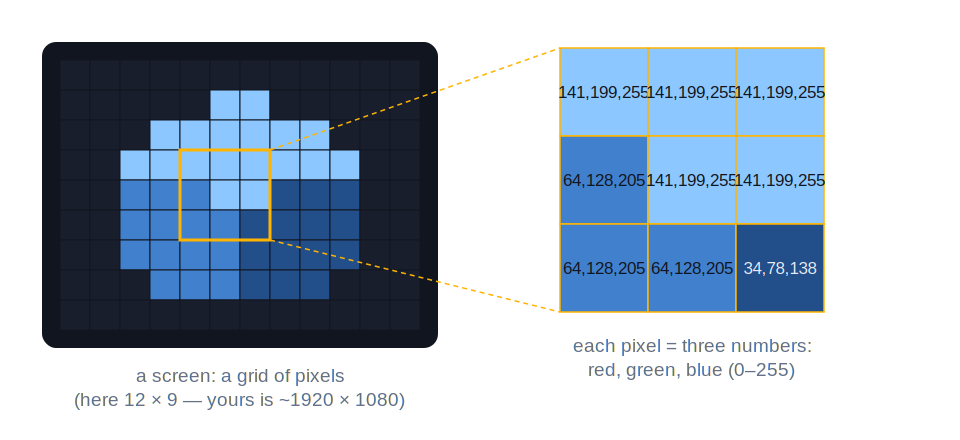

a **pixel** — *picture element* — is one little colored square of the grid

---

## A color is three numbers

- each pixel stores three numbers: **RGB** — red, green, blue intensities
- the **framebuffer** is the whole array in memory — a few million numbers
- the monitor repaints itself *from the framebuffer*, 60 times a second

So "drawing" — anything, ever — means one thing: **write numbers into the framebuffer.**

---

## Where those numbers show up

<div style="display: flex; gap: 14px; justify-content: center; align-items: flex-start;">
<div style="flex: 1 1 0; min-width: 0;"><small class="credit">© Blender Foundation | bigbuckbunny.org</small></div>
<div style="flex: 1 1 0; min-width: 0;">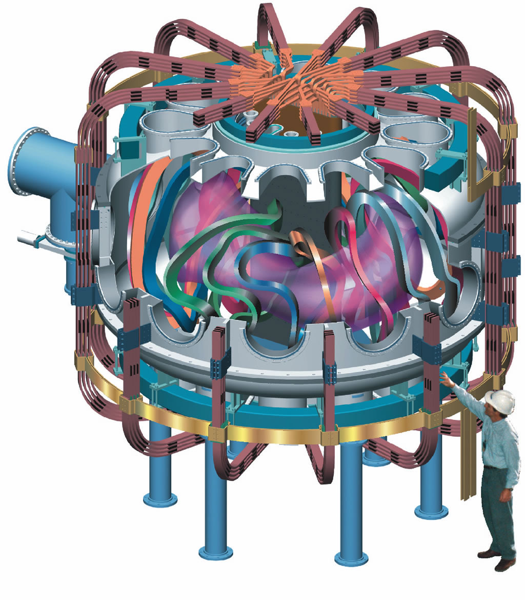<small class="credit">U.S. Government · Public domain · via Wikimedia Commons</small></div>
<div style="flex: 1 1 0; min-width: 0;">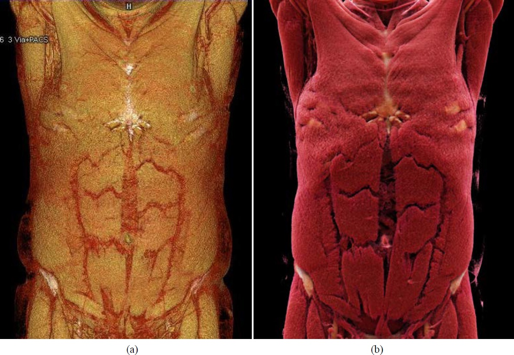<small class="credit">Franz A. Fellner · CC BY 4.0 · via Wikimedia Commons</small></div>
</div>

Games · film & VFX · CAD & engineering · medical imaging · scientific visualization · simulation & training

---

## Meet tonight's scene

```text
                      \  |  /
                    ─   sun   ─
                      /  |  \
                                     gull  ⌄
                        ██
                        ██  lighthouse
                 ▲▲▲   ████
               ▲▲▲▲▲▲▲ ████ ▲▲
        ~ ~  ▲▲▲ terrain ▲▲▲▲▲▲  ~ ~
     ~ ~ ~ ~ ~ ~ ~  water  ~ ~ ~ ~ ~ ~ ~ ~
```

An island. Terrain, water, a lighthouse, a gull, the sun.

**By the end of tonight you'll know the name of every trick it takes.**

---

### Act 1 · A world in numbers

<small>(~12 min)</small>

---

## What's in a scene

A scene is a cast list, not a picture:

- **objects** — the terrain, the water, the lighthouse, the gull
- a **camera** — the point of view the image will be made from
- **lights** — the sun, without which every pixel is black

---

## A 3D thing is a mesh of triangles


**vertices** connected into **triangles** — together, a **mesh** (a triangle is the simplest **polygon**)

---

## Build the island's ground

Our terrain is just a *grid of vertices with lifted heights*. Drag `n` (how many), then `lift` (how high).

<div class="cockpit" data-demo="mesh-grid" data-controls="n,lift"><pre class="viz-fallback">  a flat grid of vertices, each cell split into 2 triangles:
     ●───●───●───●
     │ ╱ │ ╱ │ ╱ │      drag n:    more vertices per side → finer ground
     ●───●───●───●      drag lift: raise the heights → the flat sheet
     │ ╱ │ ╱ │ ╱ │                 becomes rolling terrain
     ●───●───●───●
  same recipe at any scale: a game landscape is this, with more vertices</pre></div>

---

## Placing things: transforms

Every object carries a **transform**: *place it, orient it, size it.*

- the lighthouse: stood upright, at the island's peak
- the gull: high above, tilted into the wind
- one mesh, many placements — a forest is one tree transformed a hundred times

---

## Scenes nest: the scene graph

The **scene graph**: objects attach to objects — *move the parent, the children follow.* Drag `baseRy`, then `armBend`.

<div class="cockpit" data-demo="scene-graph" data-controls="baseRy,armBend"><pre class="viz-fallback">  base   (turn it: baseRy)
  └─ arm   (bend it: armBend)
     └─ hand
  turn the base  → arm AND hand come along for the ride
  bend the arm   → only the hand follows; the base ignores it
  same idea: lighthouse tower → lamp cage → rotating light</pre></div>

---

## Materials, first look

Each object also carries a **material** — its *surface recipe*:

- base color — the lighthouse is white with a red cap
- shininess — water glints, rock doesn't
- much more soon: Act 3 is materials, all the way down

---

### Act 2 · From scene to image

<small>(~18 min)</small>

Everything in this act, together, is **rendering**.

---

## The virtual camera

The camera makes a **projection**: the 3D scene squashed onto a flat image — near things big, far things small: **perspective**. Drag `fov`.

<div class="cockpit" data-demo="projection" data-controls="fov"><pre class="viz-fallback">        far plane
      ┌───────────────┐
       \    scene    /       the camera's pyramid of visible space
        \  objects  /        (the "frustum"), seen from outside;
         \         /         the camera's own picture appears on
          ┌───────┐          its image plane
          │ image │
           \plane/
            \   /
             (eye)</pre></div>

---

## Two projections

- *perspective* — near big, far small; how eyes and cameras see
- **orthographic** — no shrink with distance; architects' flat drawings, engineering views
- the **field of view** is the lens's zoom ring — wide for drama, narrow for telephoto

---

## Who's in front?

**Visibility**: nearer surfaces must hide farther ones. The **z-buffer** remembers *depth* per pixel:

```text
   framebuffer (color per pixel)      z-buffer (depth per pixel)
   ┌──────────────────┐               ┌──────────────────┐
   │ sky   sky   sky  │               │ far   far   far  │
   │ gull  hill  hill │               │ near  mid   mid  │
   └──────────────────┘               └──────────────────┘
   a new surface lands on a pixel:
   closer than what's stored? → draw it, remember its depth. else skip.
```

---

## Rasterization fills the pixels

**Rasterization**: color every pixel whose *center* falls inside the triangle. Drag `res` — blocky at 8, smooth at 64.

<div class="cockpit" data-demo="raster" data-controls="res,angle"><pre class="viz-fallback">   the triangle (math)          the pixels (framebuffer, res = 8)
        ▲                            · · · · · · · ·
       ╱ ╲                           · · ■ ■ · · · ·
      ╱   ╲            ──►           · ■ ■ ■ ■ · · ·
     ╱     ╲                         · ■ ■ ■ ■ ■ · ·
    ╱───────╲                        ■ ■ ■ ■ ■ ■ ■ ·
   filled where the pixel CENTER falls inside</pre></div>

---

## Lighting: three ingredients

**Lighting** turns geometry into something the eye believes. Three ingredients:

- **ambient** — the everywhere-fill; why shadows aren't pitch black
- **diffuse** — the matte part; bright where the surface *faces the light*
- **specular** — the highlight; the bright spot that slides across shiny things

---

## Drag the sun

One light, one sphere. Swing `lightAz` behind it — watch the dark side. Raise `lightEl` — noon light.

<div class="cockpit" data-demo="illumination" data-controls="lightAz,lightEl"><pre class="viz-fallback">      light ☀ (position set by lightAz around, lightEl up/down)
         \
          \        bright where the surface faces the light,
        ( sphere )     falling off to the dark side;
                       the white specular highlight slides
                       around to always face the light</pre></div>

---

## Flat vs smooth shading

**Shading** = deciding each pixel's final color from the lighting.

- *flat* — one color per triangle: faceted, disco-ball look
- *smooth* — blend across triangles: the mesh's secret facets disappear
- the classic smooth recipes are named **Gouraud** and **Phong** — names to recognize, details later

---

## The pipeline, one picture

```text
  scene  ──►  camera &      ──►  rasterize  ──►  shade  ──►  framebuffer
              projection
  (objects,   3D → flat          which pixels    what color    the numbers
   lights,    triangles          each triangle   each pixel    the monitor
   camera)    on the image       covers          gets          shows
```

This assembly line is the **pipeline** — and a **GPU** is a machine *shaped like this picture*.

---

## Act 2: our island renders!

The whole pipeline, run once over our scene — terrain, water, lighthouse, gull, sun. And yet:

- everything looks like **plastic** — the same shiny gray-ness everywhere
- every edge is **jagged** — the raster demo's stair-steps, now on everything

Two problems, two acts.

---

### Act 3 · Surfaces that lie

<small>(~12 min)</small>

---

## Paint by image: texture mapping

**Texture mapping**: glue an *image* onto a mesh. The image is the **texture**.

- brick photo on flat wall → instant masonry
- detail is now *pixels in an image*, not triangles — enormously cheaper
- our lighthouse: a white tower with painted-on brick courses and grime

---

## How the glue works: UVs

**UV coordinates**: every vertex knows *its spot on the image* — like gift-wrapping with labeled paper. Drag `offU`, then `tile`.

<div class="cockpit" data-demo="uv-placement" data-controls="offU,tile"><pre class="viz-fallback">   the texture (image)             the mesh
   ┌───────────────┐            each vertex carries a
   │ ▓▒ brick ▒▓  │            (u, v) address into the image;
   │ ▒▓ rows  ▓▒  │   ─glue─►  pixels between vertices blend
   └───────────────┘            their addresses
   drag offU: slide the wrap sideways · drag tile: repeat it more</pre></div>

---

## Bump mapping: fake the grooves

**Bump mapping** (and its modern cousin **normal mapping**): the *lighting* lies about the geometry. Drag `lightAz`, then turn `bump` to zero.

<div class="cockpit" data-demo="bump-map" data-controls="bump,lightAz"><pre class="viz-fallback">  the wall is 2 flat triangles — but its lighting pretends grooves:
    bump = 0 :  flat shading, the wall looks like what it is (flat)
    bump > 0 :  mortar lines darken and catch light like real recesses
  swing lightAz: the fake shadows TRACK the light — that's what sells it</pre></div>

---

## Textures without images

- **procedural textures** — patterns *computed*, not photographed: wood rings, marble veins, noise
- **solid textures** — the pattern fills 3D space; the object is *carved out of virtual marble*
- no photo, no seams, endless variety from a small recipe

---

## Mirrors on a budget

**Environment mapping**: reflect a *stored picture* of the surroundings.

- shiny chrome, water glints, sunglasses — without simulating any actual light bouncing
- the reflection is a lookup into a panorama photographed (or pre-rendered) once
- close enough to fool almost everyone, almost always

---

## PBR: the modern package

- modern engines bundle this whole act into **PBR** — *physically based rendering* — materials
- one standard recipe card: base color, roughness, metalness, bumps
- recognize the term: it's on every engine's material panel, every asset store

---

### Act 4 · The jaggies problem

<small>(~8 min)</small>

---

## Why edges stair-step

**Aliasing**: the pixel grid **samples** a smooth edge at too few points.

- each pixel takes *one look* at the world — at its center — and must pick a side
- a smooth diagonal, asked pixel-by-pixel, answers in stair-steps
- more pixels shrink the steps but never remove them

---

## More samples per pixel

**Anti-aliasing** by **supersampling**: take several looks per pixel, *average* them. Set `res` low, then turn `aa` on.

<div class="cockpit" data-demo="raster" data-controls="res,aa"><pre class="viz-fallback">  the same triangle edge, aa off vs on:
    aa off :  ■ ■ ■ □ □ □     each pixel all-or-nothing → stair-steps
    aa 2×2 :  ■ ■ ▓ ░ □ □     4 samples per pixel, averaged →
                              edge pixels take in-between shades
  the staircase dissolves into a soft, honest edge</pre></div>

---

## Textures alias too

- a checkerboard walking into the distance: shimmer and moiré — many texture squares per pixel
- **mipmaps**: keep *pre-shrunk copies* of every texture; each pixel reads the right size
- built into every GPU; on by default, forever

---

### Act 5 · Chasing the photograph

<small>(~10 min)</small>

---

## What our lighting can't do

Act 2's lighting is **local** — each point is lit *alone*, as if nothing else existed:

- no **shadows** — the lighthouse casts nothing onto the terrain
- no **reflections** — the water doesn't truly mirror the lighthouse
- no color bleeding — a red wall doesn't blush the white floor beside it

---

## Global illumination

<div style="display: flex; gap: 16px; justify-content: center; align-items: flex-start;">
<div style="flex: 1 1 0; min-width: 0;">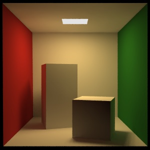<small class="credit">SeeSchloss · Public domain · via Wikimedia Commons</small></div>
<div style="flex: 1 1 0; min-width: 0;">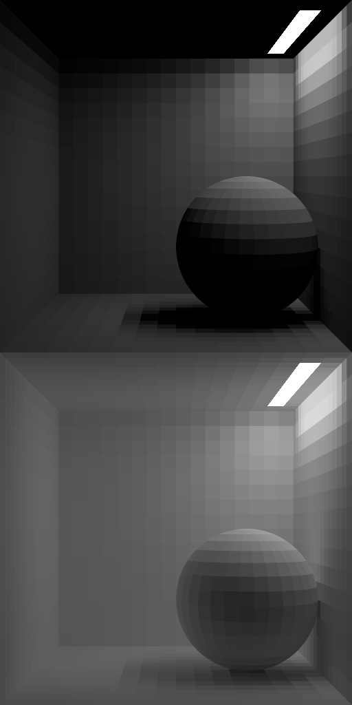<small class="credit">KaiaVintr · CC BY-SA 4.0 · via Wikimedia Commons</small></div>
</div>

**Global illumination (GI)**: let light *bounce*. The Cornell box is the field's standard test scene.

---

## How: follow the light

- **ray tracing** — trace lines of sight from the camera into the scene
- **path tracing** — follow *many bounces* per ray; the film standard
- **radiosity** — let light diffuse between surface patches; soft, matte worlds

One line each — these are *names to recognize*, not algorithms for tonight.

---

## What honest light buys

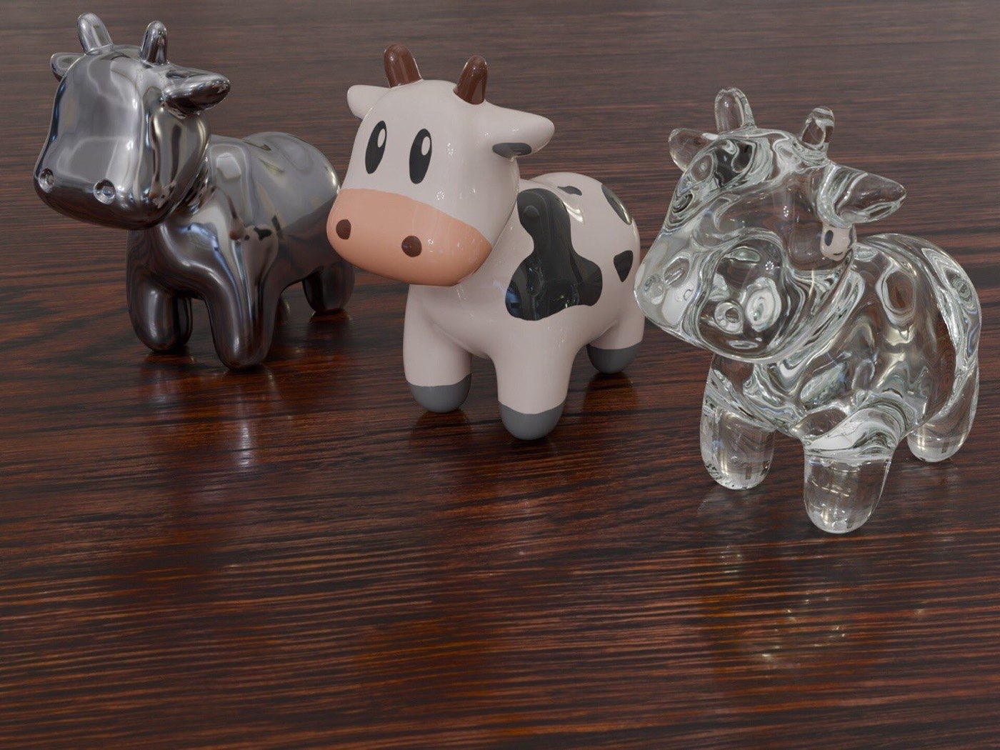
<small class="credit">KaiaVintr · CC BY-SA 4.0 · via Wikimedia Commons</small>

Not a photograph: chrome, ceramic, glass — all *followed light, honestly computed*.

---

## The price: real-time vs offline

- a game must finish each frame in about **16 milliseconds** — that's **real-time** rendering
- a film frame may take **minutes to hours** — that's **offline** rendering
- same math, wildly different budgets — the field's permanent tension

---

## Not chasing the photo: NPR

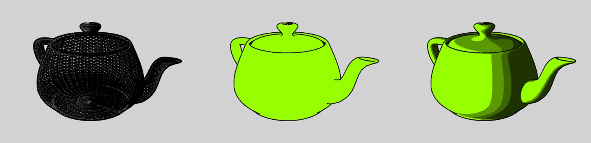
<small class="credit">NicolasSourd · CC BY-SA 3.0 · via Wikimedia Commons</small>

**Non-photorealistic rendering**: toon shading, sketch lines, painterly strokes — *realism is a choice, not the goal*.

---

### Act 6 · Where worlds come from

<small>(~14 min)</small>

---

## Scan the real world

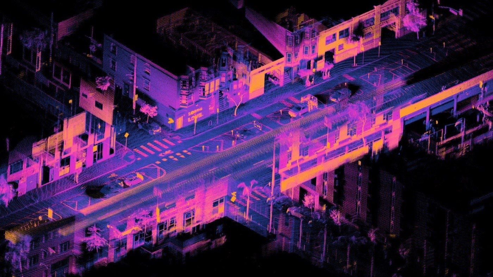
<small class="credit">Daniel L. Lu · CC BY 4.0 · via Wikimedia Commons</small>

**3D scanning**: **photogrammetry** (many photos → shape) or **LiDAR** (laser distances) → a **point cloud** → a mesh.

---

## The Stanford bunny

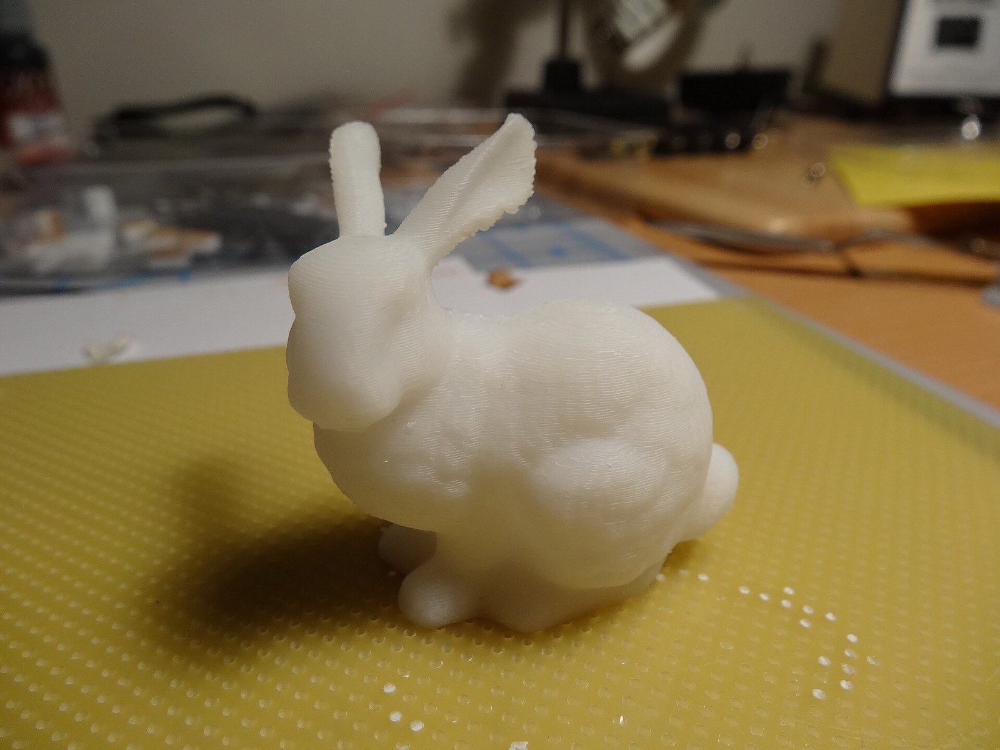
<small class="credit">funnypolynomial · CC BY 2.0 · via Wikimedia Commons</small>

- 1994: a ceramic rabbit, laser-scanned → **69,451 triangles** — the field's favorite test object
- this photo: the scan, **3D-printed back into the world**

---

## Smooth from few numbers

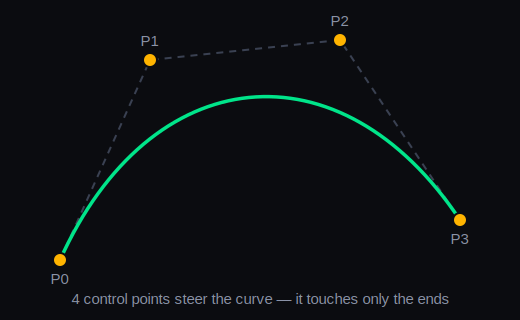

**Curves and surfaces**: a **Bézier** curve — *4 points steer a perfect curve*. Chains of them are **splines**; the surface version is **NURBS**.

---

## Subdivision surfaces

- **subdivision**: model blocky → the computer *rounds it*, step after step
- each pass splits and smooths every face; two or three passes: sculpture
- how film characters are actually modeled (an Oscar was won for it)

---

## Detail costs triangles: LOD

**Level of detail (LOD)**: keep the *same object at several resolutions* — a **multi-resolution** ladder. Push it away with `dist` — can you tell?

<div class="cockpit" data-demo="lod" data-controls="level,dist"><pre class="viz-fallback">  the same model at 5 resolutions, L0 (coarse) ... L4 (fine):
    L0: dozens of triangles ... L4: thousands
  drag level: watch the facets appear/disappear up close
  drag dist:  push it away — at distance, coarse and fine
              look IDENTICAL, so why pay for fine?</pre></div>

---

## Mesh simplification

- **mesh simplification**: *compute* the coarser rungs automatically
- collapse the edges that matter least, one by one, until the budget fits
- scans arrive with millions of triangles you don't need — this is the diet

---

## Worlds from formulas

- **procedural generation**: worlds *computed* from rules, not sculpted
- the engine: **noise** — controlled randomness at several scales, stacked
- confession: our island's terrain was never sculpted — it was noise + the Act 1 grid

---

## Volumes, not surfaces


<small class="credit">Franz A. Fellner · CC BY 4.0 · via Wikimedia Commons</small>

**Volumetric modeling**: fill space with **voxels** (3D pixels) — then **volume rendering** looks *inside*. Medicine's view of you.

---

### Act 7 · Making it move

<small>(~14 min)</small>

---

## Animation is state over time

- **animation**: change the scene's *numbers* between frames — that's all motion is
- each frame is a still; motion lives in the *differences* between consecutive stills
- the gull's flight = its transform, changing a little, 60 times a second

---

## Keyframes

**Keyframes**: pose the *important moments*; the computer **interpolates** the rest — **in-betweening**. Scrub `t`, then flip `ease`.

<div class="cockpit" data-demo="keyframe" data-controls="t,ease"><pre class="viz-fallback">  the gull's flight: 3 posed keyframes, computer fills between
     key A ●───────● key B ───────● key C
                 scrub t →
  ease = linear : constant speed, mechanical turns at keys
  ease = smooth : the corner at key B vanishes, turns are smooth — alive
  (the smooth version is a spline — Act 6's 4 points, now in TIME)</pre></div>

---

## Characters: skeletons

- **skeletal animation**: build a **rig** of bones inside the mesh
- **skinning** glues the mesh's vertices to nearby bones — bend a bone, the surface follows
- animate *dozens of bones*, not millions of vertices

---

## Motion capture

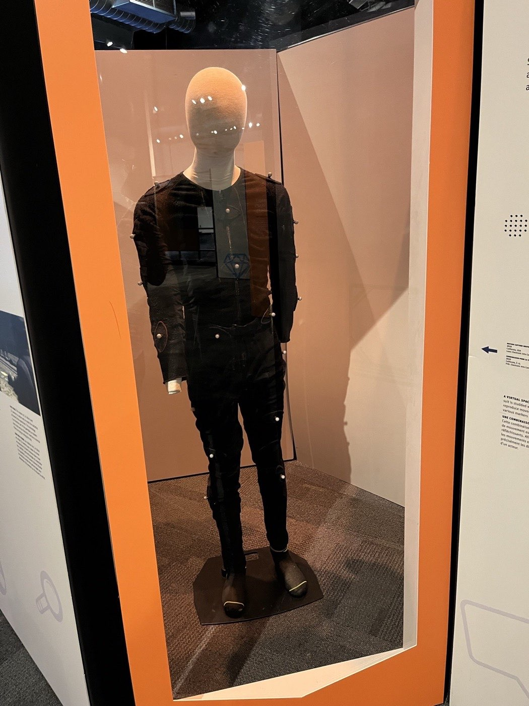
<small class="credit">Mbrickn · CC0 · via Wikimedia Commons</small>

**Motion capture**: record a *real performer's* motion onto the rig.

---

## Simulation: let physics act

- **physical simulation**: when hand-animation is hopeless — water, cloth, smoke, hair
- encode the *rules* (gravity pulls, springs resist, fluids flow) and step them each frame
- the animator becomes a *director of conditions*, not of outcomes

---

## Two families of simulation

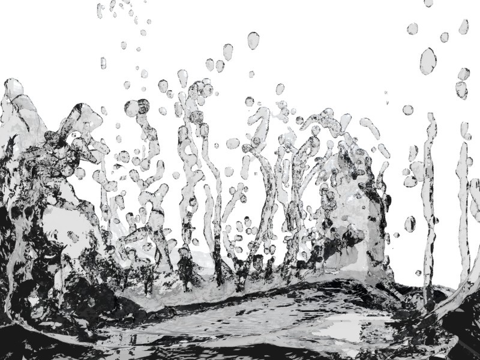
<small class="credit">Charybdis · CC BY-SA 3.0 · via Wikimedia Commons</small>

- **particles & mass-spring** (**Lagrangian**): track *moving stuff* — cloth as a spring net; **particle systems** for fire and spray
- **grid-based** (**Eulerian**): divide *space* into fixed cells; stuff flows between them — how water and smoke are done

---

## Rigid bodies & collisions

- **rigid-body** simulation: solid things tumble, stack, and rest — no bending
- **collision detection**: the other half — *notice the overlap*, push things apart
- crates, ragdolls, debris: every game's physics engine, running right now

---

## Procedural animation

- **procedural animation**: motion from *rules*, live — not recorded, not posed
- a flock: each gull follows three urges — stay close, don't crash, match neighbors
- the flock's shape is *nobody's* design — it emerges

---

### Act 8 · Worlds you can enter

<small>(~8 min)</small>

---

## Interactive = a loop

```text
        ┌────────────────────────────────────┐
        │  read input   (keys, mouse, head)  │
        │  update       (move, simulate)     │
        │  redraw       (the WHOLE pipeline) │
        └───────────────────▲────────────────┘
              again, and again, and again
```

**Redraw** everything, at a **frame rate** of ~60 per second → about **16 ms** per lap. *Thursday's lab lives inside this loop.*

---

## Games

A game is everything tonight, at once, at 60, forever:

- a scene (Act 1) rendered (Act 2) with lying surfaces (Act 3), clean edges (Act 4)
- budget lighting (Act 5), streamed LOD worlds (Act 6), animation and physics (Act 7)
- all inside the loop, answering *you*, every 16 milliseconds

---

## VR & AR


<small class="credit">MIKI Yoshihito · CC BY 2.0 · via Wikimedia Commons</small>

- **virtual reality**: one image *per eye* + head tracking — **latency** is the enemy
- **augmented reality**: draw *into* the real world — pipeline meets computer vision

---

## The frontier: neural rendering

- **neural rendering**: scenes *learned from photographs* — walk a camera anywhere in a place that was only photographed
- the names on every current paper: **NeRFs** and **Gaussian splatting**
- next door: generative 3D — describe a scene in words, receive a model — active research, week 10 territory

---

## A scanned world, live

<div class="cockpit" data-demo="gsplat" data-controls="fov"><pre class="viz-fallback">  a real photographed scene, rendered live in your browser from
  ~240,000 translucent 3D blobs (Gaussians), blended back-to-front —
  no triangle mesh, no textures; notice the soft, fuzzy edges.
  drag fov: the camera's zoom ring, live in a learned world.

  Scene: "bonsai" from the Mip-NeRF 360 dataset (Barron et al., CVPR
  2022, Google Research); .splat reconstruction by dylanebert
  (huggingface.co/datasets/dylanebert/3dgs) — see media/gsplat/ATTRIBUTION.md</pre></div>

---

## The tour is the syllabus

| Tonight | The deep dive |
| --- | --- |
| Act 1 · a world in numbers | S05 (scene graphs) · S07 (meshes) |
| Act 2 · scene to image | S02–S04 (the math) · S06 · S09 |
| Act 3 · surfaces that lie | S08 (texturing) |
| Acts 4–5 · jaggies & the photo | S09 · S10 |
| Act 6 · worlds' origins | S07 · S10 |
| Act 8 · worlds you enter | S10 |

<small>Act 7 (making it move) is woven through the machine problems.</small>

---

## Our stance, and Thursday

- this course **builds** the machinery — we don't just call it
- you will implement the engine's math yourself, then check it against the engine
- **Thursday**: Unity install · the interactive loop · MVC — bring a laptop
- **MP1 is out this week** — *details on Canvas*
- **Read Chapter 1** — the field's history, the papers, the people (linked from the course site)

