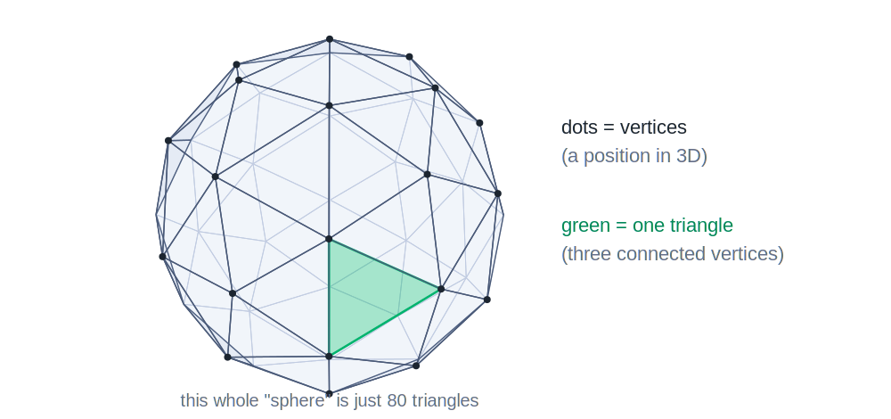

<!--
  CSS 551 · Lecture 1 (Session 1) — Graphics Systems & MVC.
  reveal.js: FLAT deck — every slide is a top-level "---" section (no vertical
  "--" stacks). This keeps the verify-deck harness's demo probe correct: it
  selects "section.present [data-demo]", which inside a vertical stack matches a
  demo on a not-yet-shown sibling slide (0x0 -> fill times out) and can also
  mis-count the walk. Flat = one section per slide = only matched when shown.
  S02-S10 copy this: keep decks flat. Notes follow "Note:".
  Real C# excerpts are from Kelvin Sung's CSS 451 ClassExamples (Topic1-Intro,
  Topic2-UI+MVC) — the same projects students open in Thursday's studio.

  MARKDOWN/KaTeX minefield (marked runs before KaTeX): never two "_" on one
  line in math; no <small> around math; verify every slide at 1280x620.
  Matrices are shown as plain preformatted text, not KaTeX, on purpose.

  DEMOS: three embeds.
   - Part 0: data-demo="projection" data-controls="fov" (the pipeline's
     3D-to-2D picture, intuitive level only) and data-demo="raster"
     data-controls="res,angle" (a triangle becoming framebuffer pixels).
   - Part 2: mvc-transform, controls tx,ry,s. Its ASCII viz-fallback shows the
     HAND-VERIFIED matrix for tx=2, ry=90, s=1:
       row i, col j = colMajor16[j*4+i]  (Mat4Panel layout); ry=90 rotation
       block is [[0,0,1],[0,1,0],[-1,0,0]], translation 2 in column 3.
  FIGURES: sessions/S01-.../figures/*.svg are GENERATED — edit
  tools/gen-figures.mjs and re-run it, never the SVGs.

  Session plan (120 min, Tue 5:45-7:45 PM synchronous online). Sums to ~110 + buffer.
    0:00  Intro (title + what tonight sets up)   ~2 min
    0:02  Part 0  Graphics in five pictures       15 min   (pixels->framebuffer->mesh->projection->raster, all intuitive)
    0:17  Part 1  Every pixel was redrawn         18 min   (the frame loop)
    0:35  Part 2  MVC for interactive graphics    30 min   (two views, one model + demo)
    1:05  Part 3  The quarter's toolset, honestly 25 min   (Unity object model + the course rule)
    1:30  Part 4  CDP walkthrough                 15 min   (SimpleGUI + SliderWithEcho screen-share)
    1:45  Wrap                                     5 min   (MP1 out, Thursday lab, office hours)
    1:50  end (+ buffer)
-->

## CSS 551

### Advanced 3D Computer Graphics

**Lecture 1 — Graphics Systems & MVC**

<small>Autumn 2026 · Tue 5:45–7:45 PM (online) · Dr. Marcel Gavriliu</small>

---

## Tonight

- **The big picture** — 3D scene to pixels, in five pictures
- **Interactive graphics is a loop** — input, update, redraw
- **MVC (Model-View-Controller)** — keeps the loop from spaghetti
- **Unity** — our workbench, toured honestly
- **The course rule** — you *build* the engine's math, not call it

<small>Thursday's studio installs Unity and opens the two projects we tour tonight. MP1 goes out this week.</small>

---

### Part 0 · Computer graphics, in five pictures

<small>(~15 min)</small>

---

## The goal, in one sentence

> Synthesize a 2D **image** of a 3D **scene** — and do it again **60 times every second**.

Five ideas hide in that sentence:

- a screen is a grid of **pixels**
- a color is **three numbers** in a **framebuffer**
- a 3D thing is a **mesh** of triangles
- a **camera projects** 3D onto a flat image
- **rasterization** fills the pixels each triangle covers

---

## Picture 1 · A screen is a grid of pixels


---

## Picture 2 · A color is three numbers

- each pixel stores **red, green, blue** intensities, 0–255 each
- the **framebuffer** is that whole array in memory — 1920 × 1080 × 3 ≈ **6 MB**
- the monitor repaints itself **from the framebuffer**, 60 times a second

So "drawing" — anything, ever — means one thing: **write numbers into the framebuffer.**

---

## Picture 3 · A 3D thing is a mesh of triangles



---

## Picture 4 · A camera projects 3D onto a flat image

A virtual **camera** projects the scene onto its **image plane** — near things big, far things small. Drag `fov`.

<div class="cockpit" data-demo="projection" data-controls="fov"><pre class="viz-fallback">        far plane
      ┌───────────────┐
       \    scene    /       the camera's pyramid of visible space
        \  objects  /        (the "frustum"), seen from outside;
         \         /         the camera's own picture appears on
          ┌───────┐          its image plane
          │ image │
           \plane/
            \   /
             (eye)</pre></div>

---

## Picture 5 · Rasterization fills the pixels

Color every pixel whose **center** falls inside the triangle. Drag `res` — blocky at 8×8, smooth at 64×64.

<div class="cockpit" data-demo="raster" data-controls="res,angle"><pre class="viz-fallback">   the triangle (math)          the pixels (framebuffer, res = 8)
        ▲                            · · · · · · · ·
       ╱ ╲                           · · ■ ■ · · · ·
      ╱   ╲            ──►           · ■ ■ ■ ■ · · ·
     ╱     ╲                         · ■ ■ ■ ■ ■ · ·
    ╱───────╲                        ■ ■ ■ ■ ■ ■ ■ ·
   filled where the pixel CENTER falls inside</pre></div>

---

## Sixty times a second

Put the pictures together — that is **rendering**. Now the punchline of the sentence:

- one frame = project and rasterize the **whole scene** — ~2 million pixels written
- 60 frames per second = ~**124 million** pixel colors per second
- that rate is why **GPUs** exist — and why per-frame code must be cheap (Part 1)

---

## Unity runs this pipeline for you

- **Unity** is a cross-platform graphics system: scene in → rendered frames out — same project on Windows, macOS, phones, consoles
- the pipeline also runs in a browser — **tonight's in-slide demos** are live 3D (a library called three.js), not screenshots
- our deal with Unity, in Part 3: it runs the pipeline — **we build the math it uses**

---

## Where each picture goes deep

| Tonight's picture | The deep dive |
| --- | --- |
| meshes of triangles | week 7 — build one by hand |
| moving things in 3D | weeks 2–5 — vectors, matrices |
| the camera & projection | week 6 — build the camera matrix |
| color, light & surfaces | weeks 8–9 — textures & illumination |
| rasterization & beyond | week 10 — GPUs, neural scenes |

---

### Part 1 · Every pixel you've ever seen was redrawn

<small>(~18 min)</small>

---

## A still image is a lie

The cube on your screen looks like it is just *sitting* there.

It is not. It is being **thrown away and redrawn** dozens of times a second.

- A monitor at 60 Hz repaints the whole frame **60 times per second**
- Nothing persists — each frame is computed from the current **state**
- "Move the cube" really means "change a number, then redraw"

---

## Two kinds of program

| Batch program | Interactive program |
| --- | --- |
| runs top to bottom, exits | runs a **loop** that never returns until quit |
| you call it | **events** call you (input, timer, frame) |
| output once | output **every frame** |
| `main()` drives | the **framework** drives; your code is a callback |

Everything you write this quarter lives in the right-hand column.

---

## The interactive loop

Every interactive graphics program is this loop:

```text
initialize state
repeat forever:
    read input        (mouse, keys, sliders)   →  maybe change state
    update state      (physics, animation)      →  maybe change state
    redraw            (render state to pixels)
```

The loop runs whether or not anything changed. Your code hooks the middle.

---

## One frame's budget

At 60 frames per second, each trip through the loop gets **16.7 ms**:

- read input, update state, and render the **entire** scene — in 16.7 ms
- miss the budget and the frame rate drops; the app feels sluggish
- so per-frame math must be cheap — and time-scaled (next slide)

---

## Predict, then reveal

The loop is running at 60 frames per second. A cube is spinning.

**What happens to the picture if the `redraw` step stops firing — but input and update keep running?**

Think for 15 seconds before the next slide.

---

## Reveal

The picture **freezes** on the last frame that was drawn.

- The cube's rotation number keeps changing every update
- But nobody turns that number into pixels anymore
- State and screen have **diverged** — the screen is stale

**Lesson:** the screen is never the truth. It is a *rendering* of the truth, only as fresh as the last redraw.

---

## Where your code goes

Frameworks give you two hooks:

- **`Start()`** — runs **once**, before the loop: set up state, wire up input
- **`Update()`** — runs **every frame**: the body of the loop is yours

In Unity, code you put in `Update()` runs **once per frame** — 60 times a second at 60 fps.

---

## Real code: the loop body

**Problem.** Slide a cube steadily to the right, on its own, every frame.

**Approach.** Read the position, nudge x, write it back — once per frame, in `Update()`.

```csharp [3-5]
void Update()
{
    Vector3 p = transform.localPosition;
    p.x += 1.0f * Time.smoothDeltaTime;
    transform.localPosition = p;
}
```

<small>MoveInX.cs — Topic1-Intro/1.1.IntroToTool (you run this Thursday).</small>

---

## Frames are not free

Why `* Time.smoothDeltaTime` and not just `+= 1.0f`?

- a frame is **not** a fixed slice of time — 60 fps here, 30 there
- `+= 1.0f` per frame moves **twice as fast** on the faster machine
- `1.0f` is a **rate** (units/second); `dt` = **seconds** since last frame
- `rate × dt` → **units**: this frame's step — same speed everywhere

---

## Input arrives two ways

The loop's **input** step handles both:

- **continuous / polled** — "is the mouse button down *this frame*?" — checked in `Update()`
- **discrete / event** — "the button was *clicked*" — a callback fires once

Polling asks every frame; events call you when something happens. Both end the same way: **change the model.**

---

### Part 2 · MVC for interactive graphics

<small>(~30 min)</small>

---

## The mess we are avoiding

An interactive app juggles three concerns at once:

- **what exists** — the cube, its position, the selected object
- **what it looks like** — pixels on screen, this frame
- **what the user did** — a slider moved, a key was pressed

Jam all three into one blob and every input handler pokes at rendering, every draw call reads half-initialized state. **MVC** splits them on purpose.

---

## MVC, with graphics meaning

| Piece | General MVC | In *our* graphics app |
| --- | --- | --- |
| **Model** | the data | the **scene state** — objects, positions, the selected item |
| **View** | a rendering of the data | a **render of the scene** — this frame's pixels |
| **Controller** | maps input to changes | **input mapping** — slider/mouse → change the model |

The Model is the truth. The View draws it. The Controller changes it.

---

## The Model is the truth

- holds scene state and **the rules for changing it**
- knows **nothing** about pixels, sliders, or which framework draws it
- ask it ("what's the radius?"); tell it ("set radius = 3")

```csharp [1-3]
public void SetSelelectedRadius(float r) {
    if (mSelectedSphere != null) mSelectedSphere.SetSize(r);
}
public float GetSelectedRadius() { ... }
```

<small>TheWorld.cs — the Model in Topic2's SliderWithEcho. Pure state, no UI.</small>

---

## The View renders the Model

- A View **reads** the Model and turns it into pixels — every frame
- Two Views of the same Model show the **same truth**, drawn differently
- A View is disposable: freeze it (Part 1) and the Model is unharmed

**The rule that makes MVC work:** a View **never writes** the Model. Data flows one way — Model → View.

---

## Two views, one model

Here is the same Model — `{tx, ry, s}` — shown two ways at once:

- a **3D cube**, transformed by the model's matrix
- a **matrix panel** reading out that exact same matrix

Drag a slider. **Both** views update, because they read **one** shared state. Neither view writes the model — the slider (Controller) does.

---

## One model, two views

<div class="cockpit" data-demo="mvc-transform" data-controls="tx,ry,s"><pre class="viz-fallback">  model {tx, ry, s} → TRS matrix (column-major), shown two ways
  ── at tx=2, ry=90°, s=1 ──────────────────────────────
     cube view:  translated +2 in x, turned 90° about y
     matrix view (row i, col j):
        [  0.00   0.00   1.00   2.00 ]
        [  0.00   1.00   0.00   0.00 ]
        [ -1.00   0.00   0.00   0.00 ]
        [  0.00   0.00   0.00   1.00 ]</pre></div>

---

## The demo, read as MVC

- **Model** — the three numbers `tx, ry, s`
- **Controller** — the three sliders; `onInput` writes the model
- **Views** — the cube *and* the matrix panel, both rebuilt from the model's matrix

Every drag is one loop turn: **input** (slider) → **update** (model → matrix) → **redraw** (both views). Part 1's loop and Part 2's pattern are the same picture.

---

## Reading the matrix panel

The matrix is not noise — each **column** has a meaning. At **ry=90°, s=1**:

```text
[  0.00   0.00   1.00   2.00 ]
[  0.00   1.00   0.00   0.00 ]
[ -1.00   0.00   0.00   0.00 ]
[  0.00   0.00   0.00   1.00 ]
```

- **cols 0–2** = where the cube's local x, y, z axes now point
- col0: x → `(0,0,-1)`; col2: z → `(1,0,0)` — a 90° turn about y
- **col 3** = where the origin moved: `(2,0,0)`, i.e. `tx = 2`

---

## Order matters

The model builds one matrix as `T · R · S` — applied to a point, read **right to left**:

- **S** scales first (around the origin)
- **R** then rotates
- **T** translates last

Reorder and you get a different result (scale-after-translate stretches the *position*). The Model fixes the order once, so both views agree.

---

## Why views never write the model

Suppose a view *could* write back. Then:

- the cube nudges the model, which moves the cube... **feedback loop**
- two views disagree — **which one is the truth?**
- to reproduce a bug you'd need every view's history, not just the model

One-way flow means the **model alone** determines the screen — reproducible, testable.

---

## One model buys you a lot

When all the truth lives in one small object, features fall out for free:

- **save / load** — serialize the model, nothing else
- **undo** — keep old model states; restore one
- **a second view** — a matrix panel, a minimap: just another reader
- **networking** — send the model's changes; every client re-renders

---

## Controller → Model, in real code

**Problem.** A slider moved. The model must change — but the slider must not know *what* it changes.

**Approach.** The slider fires a **callback**; whoever set the callback decides the effect.

```csharp [4-6]
void SliderValueChange(float v)
{
    TheEcho.text = v.ToString("0.0000");
    if (mCallBack != null)
        mCallBack(v);   // controller-supplied: "do this with the value"
}
```

<small>SliderWithEcho.cs — a reusable Controller widget (Topic2).</small>

---

## Wiring the callback to the model

Whoever owns the slider decides what its value *means*:

```csharp [3-4]
void Start() {
    TheSlider.SetSliderLabel("Radius");
    TheSlider.InitSliderRange(1, 10, 3);
    TheSlider.SetSliderListener(RadiusChanged);
}
void RadiusChanged(float r) { TheWorld.SetSelelectedRadius(r); }
```

Slider value → `RadiusChanged` → `TheWorld` (the Model). One direction, one hop.

---

### Part 3 · The quarter's toolset, honestly

<small>(~25 min)</small>

---

## Unity, in four nouns

Enough Unity to read the projects and know where our code fits:

- **GameObject** — a *thing* in the scene (a cube, a camera, a light)
- **Component** — a capability bolted onto a GameObject
- **Scene** — the current collection of GameObjects
- **Script** — a Component you write, in C#

<small>Unity gives you objects and hooks — it does not impose MVC. We bring the pattern; Part 4 maps the boxes onto real files.</small>

---

## A GameObject is a bag of Components

```text
GameObject "Player Cube"
├── Transform          position / rotation / scale   (always present)
├── MeshRenderer       makes it visible
├── BoxCollider        gives it a physical extent
└── MoveInX  (script)  ← your code: the Update() from Part 1
```

Want new behavior? **Add a Component.** Your scripts are just Components in this list.

---

## Public fields = editor wiring

The references in the real code were **public fields**:

```csharp
public Button CreateButton = null;
```

- a `public` field **shows up in the Unity Inspector**
- you **drag** a scene object onto it to set the reference — no `Find()` needed
- the `Debug.Assert(... != null)` in `Start()` catches a field you forgot to wire

Wiring the scene is partly C#, partly drag-and-drop in the editor.

---

## The scene is a hierarchy

GameObjects nest — each has a parent; transforms **compose down the tree**:

```text
Arm            (rotate the arm...)
└── Forearm    (...the forearm comes with it)
    └── Hand   (...and the hand too)
```

- **`localPosition`** — position *relative to the parent* (what MoveInX changed)
- **`position`** — position in **world** space (parent transforms folded in)

Move a parent and every child moves; that is transform composition, later a whole topic.

---

## Component vs. variable

A subtle but load-bearing distinction:

- a **Component** is attached to a GameObject; it lives in the scene
- a **field** in a script is just a variable — **not** in the scene graph
- `GameObject.Find(...)` finds a **GameObject**; then you ask it for a Component

Confusing "the scene object" with "the variable referencing it" is the week-1 bug.

---

## Wiring the scene in `Start()`

**Problem.** A script needs references to buttons, and must react when they're clicked.

**Approach.** Grab references and **subscribe** callbacks — once, in `Start()`.

```csharp [3-4]
void Start () {
    Debug.Assert(CreateButton != null);
    CreateButton.onClick.AddListener(CreateNewCube);
    ShowSphereToggle.onValueChanged.AddListener(ShowSphere);
    mTheSphere = GameObject.Find("MySphere");
}
```

<small>MainController.cs — Topic1-Intro/1.2.SimpleGUI.</small>

---

## Two hooks: Start and Update

The same setup / per-frame split as every framework:

- **`Start()`** — once: find references, subscribe, initialize
- **`Update()`** — every frame: advance animation, poll input

```csharp [3-5]
void Update () {
    Vector3 p = transform.position;
    p.y += fDelta;
    if (Mathf.Abs(p.y) > yRange) fDelta *= -1f;
    transform.position = p;
}
```

<small>BounceUpAndDown.cs — the per-frame body: bounce between ±yRange.</small>

---

## The rule for this course

Unity ships helpers that do the interesting math for you. **We don't use those.**

> **Implement-and-replace.** Where the assignment says so, you may use only **primitive** vector/matrix operations — then you *build* the engine's helper yourself and **check your build against the engine.**

The point of the course is to know what the helper *does*, not to call it.

---

## Allowed vs. off-limits

Primitives are your Lego bricks; the composites are what you **build from them**.

| You MAY use (primitives) | OFF-LIMITS (per the MP) |
| --- | --- |
| `Vector3.Dot`, `Vector3.Cross` | `Transform.LookAt` |
| `Vector3.Normalize`, `.magnitude` | `Quaternion.LookRotation` |
| component access `v.x, v.y, v.z` | any "orient toward" helper |
| basic transforms (translate, set matrix) | composited convenience calls |

---

## Why build what the engine already does

- **Understanding** — `LookAt` is a black box until you've built it from dot and cross
- **A ground truth** — the engine's version is your **answer key**: build yours, compare
- **Transfer** — every engine has these helpers; the *math* is what carries between them

MP1 is your first implement-and-replace: orient an object, then check against Unity.

---

### Part 4 · CDP walkthrough

<small>(~15 min)</small>

---

## Code-Demo-Practice

**CDP = Code, Demo, Practice.** We read real code, watch it run, then you rebuild it.

Tonight's demo pair (screen-share now, re-open Thursday):

- **1.2.SimpleGUI** — buttons and a toggle driving the scene
- **2.3.SliderWithEcho** — the full MVC triad in one small project

Both are in the course materials on Canvas.

---

## SimpleGUI — files at a glance

```text
1.2.SimpleGUI
├── MainController.cs      ← Controller: wires buttons/toggle, handlers
├── MyCube (prefab)        the thing CreateNewCube instantiates
└── MySphere               the object ShowSphere toggles
```

Small on purpose: **one** script holds all the wiring. Read `MainController.cs` top to bottom and you have the whole app.

---

## SimpleGUI — what to look at

The whole app: create cubes, delete, toggle a sphere's visibility.

```csharp [1-2]
void CreateNewCube() {
    GameObject cube = Instantiate(Resources.Load("MyCube")) as GameObject;
    cube.transform.position = new Vector3(10, 0, 10);
}
void ShowSphere(bool on) { mTheSphere.GetComponent<Renderer>().enabled = on; }
```

Watch: each button handler is **one small change to the scene** — a Controller action.

---

## SimpleGUI — the wiring, again

Recall the `Start()` from Part 3 — this is the same file:

- three UI references, asserted non-null
- three handlers subscribed: two buttons, one toggle
- one scene lookup cached (`mTheSphere`)

**The pattern to internalize:** references + subscriptions in `Start()`, one small handler per action. Every UI project this quarter looks like this.

---

## SliderWithEcho — the MVC triad

- **Model** — `TheWorld` holds the selected sphere and its radius
- **View** — the sphere in the scene *and* the echoed number
- **Controller** — `SliderWithEcho` + `MainController` wire slider → model

This is Part 2's diagram, now as a project you can open.

---

## SliderWithEcho — files to MVC boxes

```text
2.3.SliderWithEcho
├── Model/TheWorld.cs              ← Model: selected sphere + its radius
├── UI Support/MainController.cs   ← Controller: wires slider → RadiusChanged
└── Prefab Support/UIPrefab/
    └── SliderWithEcho.cs          ← Controller widget: slider + echo readout
```

Each file is one MVC box. Open the project Thursday and label them yourself.

---

## Trace one slider drag

Follow the value through the triad:

```text
user drags slider
  → SliderValueChange(v)      [Controller widget: echo + forward]
  → RadiusChanged(v)          [Controller wiring: what it means here]
  → TheWorld.SetSelelectedRadius(v) [Model: change scene state]
  → next frame: sphere re-rendered at new size   [View]
```

One drag, one pass through **Controller → Model → View**. No arrows point backward.

---

## Thursday: you drive

In the studio you will:

- install Unity 6 (Unity Hub) and open **1.1.IntroToTool** and **1.2.SimpleGUI**
- run them, then **change a named variable** in `MainController.cs`, predict, re-run
- open **2.3.SliderWithEcho** and map each file to an MVC box

Tonight you watched the loop; Thursday you poke it.

---

## The whole night, on one slide

- **The pipeline** — meshes → projection → pixels
- **A loop** — input → update → redraw, ~60×/s
- **The screen** is a *rendering* of the truth
- **MVC** — Model is truth; Views read, Controllers write
- **Unity** — GameObjects + Components, `Start()`/`Update()`
- **The rule** — build the math, check against the engine

---

## Wrap

- **MP1 is out this week** — your first implement-and-replace (orientation). *Details on Canvas.*
- **Thursday studio** — install Unity, open tonight's two projects, first pokes
- **Office hours** — see Canvas; bring the week-1 struct-copy bug if you hit it

The screen is a rendering of the truth. Keep the truth in one place, and let one direction of flow move it.

