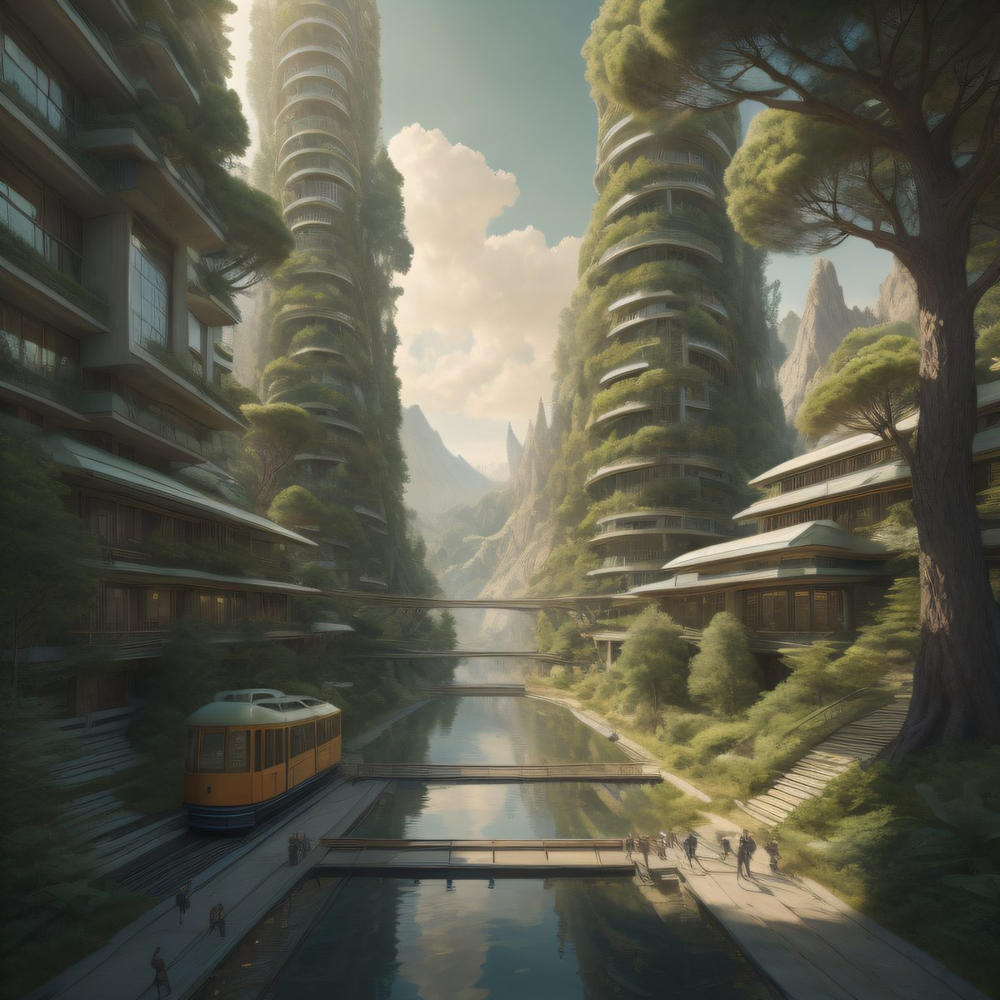
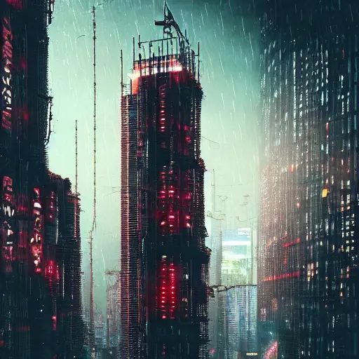
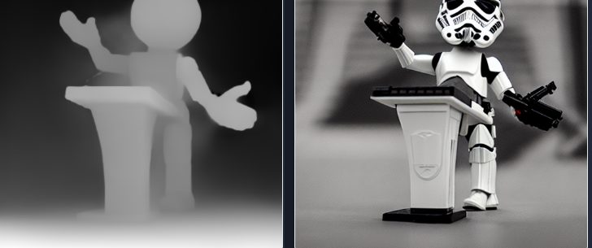

<!--
  CSS 551 · Lecture 10 (Session 10) — PBR, Diffusion Models & Learned Scenes.
  THE GRADUATE FINALE, rebuilt 2026-09-16 (design: planning/css551-s10-
  generative-rebuild-design-2026-09-16.md). Three beats: honest light (the
  rendering equation and PBR, shortened), learned images (diffusion models,
  conceptual, with a live toy demo), learned scenes (NeRF and 3D Gaussian
  splatting, live). Then the course in one picture, and a closing beat that
  ENDS the course. The former GPU/API-model segment is dropped by decision.

  reveal.js: FLAT deck — every slide a top-level "---" section (no "--"
  stacks). Notes follow "Note:". Math is plain unicode text or fenced ```text
  blocks (no KaTeX plugin). Never two "_" on one markdown line outside a code
  fence; backtick names with underscores. No <small> on math. No forward
  references; the last slide ends the course.

  DEMO EMBEDS (nine, each on its own flat slide; brdf-lobe and gsplat under
  the scoped 210px crop, the seven Part-2 exhibits on demo-full slides that
  get the full ~500px viewport, as in S01). Part 2 opens with two exhibits on
  networks and embeddings, then a LADDER of five on diffusion:
   - Part 1: data-demo="brdf-lobe"        data-controls="roughness"
   - Part 2: A data-demo="mlp-fit"          data-controls="epochs,hidden" (a network is a function; trained live)
             B data-demo="embed-map"        data-controls="highlight" (class embeddings read from the trained denoiser)
             C data-demo="diffusion-image"  data-controls="t"      (a real render dissolving)
             D data-demo="diffusion-2d"     data-controls="steps,stochastic" (the mechanism on dots)
             E data-demo="diffusion-digits" data-controls="steps"  (exact denoiser on MNIST: memorizes)
             F data-demo="diffusion-digits" data-controls="smooth" (kernel bandwidth: novel digits)
             G data-demo="diffusion-net"    data-controls="guide,steps" (a TRAINED MLP denoiser, in-browser)
   - Part 3: data-demo="gsplat"           data-controls="fov"
  All exact-denoiser demos are deterministic (seeded); every caption says the
  denoiser is the exact posterior mean for the finite set, the function a
  network approximates. diffusion-net's weights: lib/assets/mnist/
  mlp-denoiser.{bin,json}, trained by tools/train-mlp.py (10 min, CPU).

  MEDIA: ../../media/generative/*.jpg, license-verified; credit lines copied
  VERBATIM from media/generative/CREDITS.md.
  READING: ../../handouts/ch10-learned-images-and-scenes.html (Chapter 10, with
  MathJax) is linked from the Tonight and Wrap slides.

  Session plan (120 min, Tue 5:45-7:45 PM synchronous online):
    0:00  Intro                                   3 min
    0:03  Part 1  From Phong to PBR              12 min  (two Phong slides merged; radiometry cut)
    0:15  Part 2  Learned images: diffusion      81 min  (networks, embeddings, the space of images; seven exhibits; the papers)
    1:36  Part 3  Learned scenes: NeRF and 3DGS  12 min  (NeRF pair merged)
    1:48  Part 4  The course in one picture       7 min
    1:55  Wrap                                    5 min
    2:00  end
-->

## CSS 551

### Advanced 3D Computer Graphics

**Lecture 10 — PBR, Diffusion Models & Learned Scenes**

<small>Autumn 2026 · Tue 5:45–7:45 PM (online) · Dr. Marcel Gavriliu</small>

---

## Tonight

- **From Phong to PBR** — the honest energy accounting Phong approximates; **BRDFs**, microfacets, the **metallic/roughness** model
- **Learned images: diffusion** — destroy an image with noise, learn to undo it, sample; text, control, video; a toy you can drive
- **Learned scenes: NeRF and 3DGS** — one scene learned from photographs, rendered live; where learned images and learned scenes meet
- **The course in one picture** — every piece you built this quarter, assembled

<small>Reading: <a href="../../handouts/ch10-learned-images-and-scenes.html">Chapter 10</a>, where tonight's lines are written out (the rendering equation, the exact denoiser, images as functions).</small>

---

### Part 1 · From Phong to the rendering equation

<small>(~12 min)</small>

---

## Phong's confession, and what it gets wrong

Last week's local model shaded each point from the lights, the normal and the eye, and **nothing else in the scene**. Three departures from physics:

- **energy** — Phong can reflect **more** light than arrives; a real surface reflects **at most** what hits it
- **reciprocity** — swap the light and the eye and a real surface looks identical; Phong's terms carry no such guarantee
- **no bounces** — the scene's **indirect** light (color bleeding, soft shadows) is absent, faked by the **ambient** constant

Not three bugs but one gap: Phong never **balances the light energy** at a point. Tonight, the honest accounting.

---

## The rendering equation

Kajiya, 1986 — the honest balance of light at a surface point `p`, for the outgoing direction `ωo` toward the eye:

```text
   Lo(p, ωo) = Le(p, ωo) + ∫  f(p, ωi, ωo) · Li(p, ωi) · (n·ωi) dωi
                            Ω
```

Every symbol:

- **Lo(p, ωo)** — outgoing radiance from `p` toward the eye (**what the pixel gets**)
- **Le(p, ωo)** — light `p` **emits** itself (nonzero only if `p` is a light source)
- **∫ … dωi over Ω** — **sum over every incoming direction** `ωi` in the hemisphere `Ω` above `p`
- **f(p, ωi, ωo)** — the **BRDF**: what fraction of light from `ωi` leaves toward `ωo` (the material)
- **Li(p, ωi)** — incoming radiance **arriving** at `p` from direction `ωi`
- **(n·ωi)** — the **cosine** / projected-area factor — last week's **N·L**

---

## The BRDF: the material's answer

Pull one factor out of the integral: `f(p, ωi, ωo)`, the **BRDF** — **B**idirectional **R**eflectance **D**istribution **F**unction. Given light from `ωi`, it returns the fraction that leaves toward `ωo`. It **is** the material:

```text
   diffuse (matte)   f = constant          same to every direction → the flat, view-independent term
   specular (shiny)  f peaks near mirror    big only when ωo is near L's reflection → the highlight
```

A **physical** BRDF must obey exactly the rules Phong broke:

- **non-negative** — no negative light
- **reciprocal** — `f(ωi, ωo) = f(ωo, ωi)` — swap light and eye, same value (Helmholtz)
- **energy-conserving** — integrated over the hemisphere, it reflects **at most** what arrived

Phong and Blinn from S09 **are** BRDFs — just crude ones that break the last two.

---

## Microfacets, and the two sliders

The physical specular BRDF models a rough surface as a field of microscopic **perfect mirrors**, the **microfacets**; a highlight is the **statistical fraction** angled to bounce the light into your eye.

```text
   smooth surface            rough surface
   ▁▁▁▁▁▁▁▁▁▁  facets aligned  ╱╲╱╲╱╲╱╲  facets scattered
   → tight, bright highlight   → broad, dim highlight
```

- **Cook-Torrance** assembles three factors: **D** (how many facets point the right way; **roughness** lives here), **G** (facets shadow each other at grazing angles), **F** (**Fresnel**: every surface is mirror-like edge-on)
- engines expose two artist sliders on top: **metallic** (dielectric: colored diffuse + weak white specular; metal: no diffuse, tinted specular) and **smoothness** (Unity's name for 1 − roughness)
- the same machinery under Unity's Standard Shader, glTF and every modern renderer

---

## The reflectance lobe: roughness reshapes it

The specular BRDF, drawn as a **polar lobe** around the mirror direction, shows how tightly a surface focuses reflected light. **Roughness** sets its width. Two models, two roughness→width mappings:

```text
   Phong:  radius ∝ max(0, cos φ)^s      s = 2/roughness² − 2   (classic Blinn mapping)
   GGX:    the GGX normal-distribution shape        α = roughness²
```

At **roughness = 0.4** (the demo default):

```text
   Phong:  s = 2/0.4² − 2 = 10.5      lobe half-width (HWHM) ≈ 21°
   GGX:    α = 0.4² = 0.16            lobe half-width (HWHM) ≈  6°
```

Same roughness, **different** lobe: GGX has a **narrower core** (and, in a full BRDF, wider tails) — which is why `GGX` became the modern default. **Honest note:** the demo's GGX curve is the distribution's **shape** reused as a lobe radius — no Fresnel, no geometry term, no solid-angle normalization. **Shape, not calibrated units.**

---

## The lobe, live

<div class="cockpit" data-demo="brdf-lobe" data-controls="roughness"><pre class="viz-fallback">  our Cornell scene, wearing ONE BRDF: gold metal teapot + aluminum box,
  plastic bunny + glossy tall box; drag roughness to reshape every highlight
  -- roughness = 0.4 (default) ---------------------------------------------
     Phong:  s = 2/0.4² − 2 = 10.5      HWHM ≈ 21°
     GGX:    α = 0.4²       = 0.16      HWHM ≈  6°
     same roughness, narrower GGX core (shape, not calibrated units:
     no Fresnel, no geometry term, no solid-angle normalization)
     drag roughness → 0.05 for needle-thin mirror highlights; → 1 for broad matte</pre></div>

---

### Part 2 · Learned images: diffusion

<small>(~81 min)</small>

---

## A network is a function

A **neural network** is a function with knobs: inputs in, numbers out, and thousands to billions of **weights** that shape it.

- **training**: show it examples, measure how wrong it is, nudge every weight a little to be less wrong; repeat (**backpropagation**, Rumelhart, Hinton & Williams 1986)
- with enough units it can fit almost any function (the **universal approximation** theorems, Cybenko 1989, Hornik 1991)
- exhibit A next: twelve points, a network with 37 weights, trained **live** in front of you, step by step
- watch for: the curve bending as the epoch counter ticks, and what it does **between** the points

---

<!-- .slide: class="demo-full" -->

## Exhibit A: a function that learns

<div class="cockpit" data-demo="mlp-fit" data-controls="epochs,hidden"><pre class="viz-fallback">  twelve (x, y) points from a hidden curve; a two-layer network
  f(x) = Σ w2·tanh(w1·x + b1) + b2 with 3·hidden + 1 weights
  drag epochs up from 0: training runs LIVE, a few gradient steps per frame;
  the random wiggle bends until it passes through the points, the epoch
  counter ticks, and a loss-vs-epoch plot grows in the corner. Drag down: reset.
  drag hidden to 2: it cannot bend enough; to 40: it fits, smoothly
  buttons: wave · step · bump.  Readout: weights, epochs run, error, state</pre></div>

---

## Embeddings: a vector for a concept

An **embedding** is a learned vector that stands for a thing, placed so that **similar things are near**.

- words (word2vec, Mikolov et al. 2013): "king" near "queen", far from "carburetor"; arithmetic in the space works
- nobody places the points; a network puts them where its job goes better
- exhibit B next: the digit-drawing network you will meet later carries ten such vectors, one per digit; we read them out of its weights and map them
- watch for: which digits end up as neighbors, and why

---

<!-- .slide: class="demo-full" -->

## Exhibit B: embeddings, read from the weights

<div class="cockpit" data-demo="embed-map" data-controls="highlight"><pre class="viz-fallback">  the ten class embeddings (64 numbers each) inside the trained digit
  denoiser, projected to their two principal axes (36% of the variance)
  drag highlight: lines to the digit's three nearest classes, cosines in
  the readout. 4 is nearest 9 (0.54), 3 nearest 5 (0.52), 7 nearest 9 (0.48):
  digits that share strokes were placed near each other by training alone</pre></div>

---

## Encoders and decoders

An **encoder** maps a thing to its embedding; a **decoder** maps an embedding back to a thing.

```text
   image  ──encoder──▶  a few thousand numbers  ──decoder──▶  image (nearly)
   train both together to reproduce the input: an autoencoder
```

- the middle is a **compressed** description: only what matters survives (Hinton & Salakhutdinov 2006)
- the Cornell render you will see in exhibit C is 49,152 numbers; its latent in Stable Diffusion would be 16,384
- keep the two names apart: **encoder** = thing to vector, **decoder** = vector to thing

---

## Two encoders, one space

Train an **image encoder** and a **text encoder** in parallel so that a photo and its caption land on the **same point**.

```text
   "a tabby cat on a sofa"  ──text encoder──▶   ●
   [photo of that cat]      ──image encoder─▶   ● ← pulled together
   [photo of a truck]       ──image encoder─▶       ● ← pushed apart
```

- **contrastive** training on hundreds of millions of (image, caption) pairs: **CLIP** (Radford et al. 2021)
- afterwards, words and pictures are the same kind of vector; a caption is a point you can aim at
- this is the "concept" coordinate system the rest of the night uses

---

## The space of images

An **m × n RGB image is a point** in a vector space of dimension **3·m·n**: one axis per number, three numbers per pixel. Equally, it is the **vector** from the origin to that point.

```text
   image  =  (r₁₁, g₁₁, b₁₁,  r₁₂, g₁₂, b₁₂,  ...,  r_mn, g_mn, b_mn)  ∈  [0,1]^(3·m·n)
   128 × 128 RGB  →  49,152 coordinates;   512 × 512 RGB  →  786,432
```

- almost every point in that space is **static**; the meaningful images are a thin, tangled region
- every meaningful image carries **concepts you can say in words**: the encoder maps it to a concept embedding
- **generating** = landing a new point inside the thin region, on purpose

---

## The concept map is not invertible

The encoder is **many-to-one**: thousands of cat photographs land on one "cat" embedding. Its inverse is **one-to-many**: a caption does not pick an image, it picks a **distribution** of images.

```text
   images  ──encoder──▶  concept        (many → one: fine)
   concept ──?──▶  which image?          (one → many: no function can do it)
```

- a generator cannot be a plain decoder of the caption: it would have to return one image for "cat", forever
- something must supply the **missing choices**: which cat, which pose, which light

---

## Noise is the choice

Diffusion supplies the missing information as **random noise**, then spends its steps turning that noise into a picture that fits the concept.

```text
   destroy:   walk real images into noise on a schedule        (no learning)
   learn:     a network that undoes one small step, given the concept
   sample:    start from fresh noise, undo step by step        (one image per noise)
```

- a different starting noise gives a different cat; the caption steers, the noise decides
- one-to-many, solved: the recipe is Sohl-Dickstein et al. 2015, made practical by Ho, Jain & Abbeel 2020
- the exhibits that follow do each line of the recipe where you can see it

---

## Forward: add noise, on schedule

A schedule of small noising steps turns **any** image into pure noise; by the end, every image looks the same.

```text
   x(0) = the image        x(t) = √ᾱ(t) · image  +  √(1−ᾱ(t)) · noise
   x(1) = pure noise, no trace of the image;  nothing is learned here
```

- exhibit C next: the course's Cornell render, 49,152 numbers, dissolving as `t` moves
- watch for: the `t` where you stop recognizing a room, and where the signal-to-noise ratio crosses 0 dB

---

<!-- .slide: class="demo-full" -->

## Exhibit C: a real picture, dissolving

<div class="cockpit" data-demo="diffusion-image" data-controls="t"><pre class="viz-fallback">  left: x(0), the Cornell render (128×128×3 = 49,152 numbers)
  right: x(t) = √ᾱ · x(0) + √(1−ᾱ) · noise, for the t on the slider
  drag t: around 0.5 the room is still there; around 0.7 it is gone;
  at 1 nothing remains. Readout: ᾱ(t), SNR in dB, PSNR vs the original.</pre></div>

---

## Reverse: a denoiser

The learned part. Given a noisy point and its `t`, predict the noise that was added (equivalently: where the clean point was).

- the network's job in one sentence: **"from here, which way is the data?"**
- that answer is a **vector field** over the whole space: at every noisy point, a pull toward the sheet
- exhibit D next: 400 points on a spiral stand in for "all images", so the field can be drawn; the demo's denoiser is the **exact** optimal answer for those 400 points, the thing a network approximates
- watch for: the spiral **reassembling** from noise, and how few `steps` it takes

---

<!-- .slide: class="demo-full" -->

## Exhibit D: the mechanism, on dots

<div class="cockpit" data-demo="diffusion-2d" data-controls="steps,stochastic"><pre class="viz-fallback">  start from pure noise; ask the denoiser "which way is the data?"
  steps times, moving a little each time: the spiral reassembles
  drag steps:  3 (coarse, points land between arms) → 20 → 80 (crisp)
  stochastic:  DDIM (deterministic: same start, same landing) vs
               DDPM (a little fresh noise each step: the same start wanders)
  readout: nearest-data distance falls as the shape comes back</pre></div>

---

## Training, in one line

```text
   pick an image, pick a random t, add that much noise,
   ask the network for the noise, compare, nudge the weights.   repeat, billions of times.
```

- **denoising diffusion** (Ho, Jain & Abbeel, 2020): the recipe above, and nothing else
- every step is a small, well-posed regression: predict a known noise vector
- that is why it trains stably where earlier generative methods fought their own training

---

## From dots to digits

Same mechanism, real images: **2,000 handwritten digits**, 20×20 pixels, so each image is a point in a **400-dimensional** space.

- the denoiser is still the **exact** best answer for that finite set: an average of the training digits, weighted by how likely each was the origin
- exhibit E next: start from noise, walk back; a digit appears
- watch for the panel on the right: every sample lands **exactly on a training digit**. An exact denoiser for a finite set can only **memorize**

---

<!-- .slide: class="demo-full" -->

## Exhibit E: digits, the exact denoiser

<div class="cockpit" data-demo="diffusion-digits" data-controls="steps"><pre class="viz-fallback">  2,000 MNIST digits (20×20) = the training set; a digit is a 400-vector
  start from noise; the exact posterior-mean denoiser walks back `steps` times
  the panel shows the selected sample beside its nearest training digit:
  distance 0.000, verdict "memorized": an exact denoiser only returns the set
  buttons pick the digit (conditioning); click a sample to inspect it
  MNIST (LeCun, Cortes, Burges) · CC BY-SA 3.0</pre></div>

---

## The leap: from lookup to generalization

A network cannot store the training set; it learns a **smooth** function that agrees with it. Exhibit F fakes that with one knob.

- `smooth` widens the denoiser's kernel: it keeps **blending neighbors** all the way to the end instead of snapping to one training digit
- watch for: the nearest-digit distance jumping above the threshold, and digits **nobody wrote**
- too smooth, and every sample collapses to one blurry average: the other failure

---

<!-- .slide: class="demo-full" -->

## Exhibit F: digits nobody wrote

<div class="cockpit" data-demo="diffusion-digits" data-controls="smooth"><pre class="viz-fallback">  same 2,000 digits, same walk; drag smooth:
    exact   → every sample is a training digit (distance 0.000, memorized)
    h ≈ 3   → blends of neighbors: new digits, distance ≈ 0.2, "novel"
    h = 5   → one blurry average: too smooth
  the network in the next exhibit learns the middle regime by itself</pre></div>

---

## A real learned denoiser

Exhibit G replaces the exact answer with a **trained network**: a small MLP, about a million weights, trained for fifteen minutes on a laptop CPU on 60,000 digits, running in your browser now.

- at sampling time it never sees the training set; it only remembers what it learned about digits
- the digit buttons are **conditioning** (a class embedding, the slot text goes into later); `guide` is **classifier-free guidance**: exaggerate what the class adds
- watch for: the nearest-digit distance, well above the threshold for every sample, and what `guide` does to the strokes

---

<!-- .slide: class="demo-full" -->

## Exhibit G: the network draws

<div class="cockpit" data-demo="diffusion-net" data-controls="guide,steps"><pre class="viz-fallback">  a trained class-conditional MLP denoiser (≈1,000,000 weights, 15 minutes
  of CPU training on 60,000 MNIST digits) samples 12 digits from noise
  buttons: which digit (conditioning)   guide: classifier-free guidance w
  the panel: nearest training digit, distance well above the memorization
  threshold for every sample: these digits were learned, not looked up
  MNIST (LeCun, Cortes, Burges) · CC BY-SA 3.0</pre></div>

---

## Latent diffusion: why it got cheap

A 512×512 RGB image is 786,432 numbers; denoising that a thousand times per picture is unaffordable.

```text
   image (512×512×3)  ──encoder──▶  latent (64×64×4)  ──diffuse here──▶  ──decoder──▶  image
   a learned, lossy compression: 48× fewer numbers to denoise
```

- a **variational autoencoder** learns the compression once; diffusion runs in the small space
- decode once at the end; the decoder restores the fine texture the latent left out
- this is **Stable Diffusion** (Rombach et al., 2022), and it is why the method left the lab

---

## Text in the class slot

Exhibit G's digit button was a **class embedding**. A prompt is the same slot, filled by text.

- **CLIP** (2021): a joint embedding trained so an image and its caption land near each other; words become vectors the network reads
- the denoiser attends to those vectors at every step (**cross-attention**): "which way is the data, *given this caption*?"
- **classifier-free guidance** (Ho & Salimans, 2022) is exhibit G's `guide`: train with and without the caption, exaggerate the difference by `w`


<small class="credit">MrAlanKoh · CC BY-SA 4.0 · via Wikimedia Commons (one row of the original grid)</small>

---

## The network is whatever scales

- ours: an MLP, a million weights, fifteen minutes; theirs: a **U-Net** (2020–22), then a **diffusion transformer** (DiT, Peebles & Xie 2023) with billions, on image patches
- the recipe (noise, learn to undo, sample) did not change from exhibit G to the frontier; the network and the data got bigger
- gallery next: what the recipe draws at that scale

---

## Where it came from: the papers (2015–2020)

| Year | Paper | What it added |
| ---- | ----- | ------------- |
| 2015 | Sohl-Dickstein, Weiss, Maheswaranathan & Ganguli, *Deep Unsupervised Learning using Nonequilibrium Thermodynamics* | **diffusion probabilistic models**: destroy, learn to undo |
| 2019 | Song & Ermon, *Generative Modeling by Estimating Gradients of the Data Distribution* | the **score** (vector field) view |
| 2020 | Ho, Jain & Abbeel, *Denoising Diffusion Probabilistic Models* | **DDPM**: predict the noise; it works at scale |
| 2020 | Song, Meng & Ermon, *Denoising Diffusion Implicit Models* | **DDIM**: deterministic, few-step sampling |

---

## Where it came from: the papers (2021–2023)

| Year | Paper | What it added |
| ---- | ----- | ------------- |
| 2021 | Dhariwal & Nichol, *Diffusion Models Beat GANs on Image Synthesis* | guidance; quality past GANs |
| 2021 | Radford et al., *Learning Transferable Visual Models from Natural Language Supervision* | **CLIP**: text and images, one space |
| 2022 | Ho & Salimans, *Classifier-Free Diffusion Guidance* | the `guide` knob |
| 2022 | Rombach et al., *High-Resolution Image Synthesis with Latent Diffusion Models* | **Stable Diffusion**: diffuse in a latent |
| 2022 | Ramesh et al. (DALL·E 2); Saharia et al. (Imagen) | text-to-image at scale, two routes |
| 2023 | Peebles & Xie, *Scalable Diffusion Models with Transformers* | **DiT**: the network is whatever scales |

---

## Gallery: prompt to image

<div style="display: flex; gap: 12px; justify-content: center; align-items: flex-start;">
<div style="flex: 1 1 0; min-width: 0;"><small class="credit">Prototyperspective · CC0 · via Wikimedia Commons</small></div>
<div style="flex: 1 1 0; min-width: 0;"><small class="credit">CC0 · via Wikimedia Commons</small></div>
<div style="flex: 1 1 0; min-width: 0;"><small class="credit">Benlisquare · Public domain · via Wikimedia Commons</small></div>
</div>

<small>Prompts, left to right: "utopia at street level in city … solarpunk, green trees, matte painting" · "Cyberpunk, Tower of Babel, in the rain, highly detailed, illustration" · "Hakurei Shrine in distance … forests, mountains, rivers" (Stable Diffusion, 2022–23)</small>

---

## Graphics-flavored control

**ControlNet** (Zhang, Rao & Agrawala, 2023): condition the denoiser on a **depth map**, a **normal map**, or an edge image, and it keeps that structure.


<small class="credit">lllyasviel/ControlNet README, depth example · Apache-2.0 · github.com/lllyasviel/ControlNet</small>

- a depth buffer (S06) and normals (S07) are exactly what **our pipeline produces**
- render the geometry you control, let diffusion paint the appearance

---

## Text to 3D: the two halves meet

**Score distillation** (DreamFusion, Poole et al., 2022): optimize a 3D scene so that **renders of it** score well under a text-conditioned image model.

```text
   3D scene (a NeRF or Gaussians)  ──render from a random view──▶  image
   image diffusion model: "does this look like <prompt>? push it this way"
   the push flows back through the renderer into the 3D scene; repeat
```

- diffusion **judges**, the pipeline **renders**, gradients flow through both
- the result is a real 3D asset: a camera you can move, geometry you can export
- this is where learned images meet learned scenes, Part 3's subject

---

## Video: add a time axis

A clip is a **3D block of latents** (x, y, t). Frames must see each other; the rest of the recipe is unchanged.


<small class="credit">prompted by Lumi's AI Dreams · Public domain · via Wikimedia Commons (six frames)</small>

- **temporal attention**: each frame's denoiser attends to its neighbors in time, so motion is consistent
- **video diffusion** (Ho et al., 2022) to Sora-class models (2024): the same noise-and-undo recipe on space-time patches

---

## What still breaks, and what graphics keeps

- **object permanence, physics, counting, text**: no scene exists inside the model, so nothing enforces them
- **no camera to move, no light to change, no edit that keeps everything else fixed**
- graphics keeps: **control**, **consistency**, **real time**
- the two are merging: generated textures and assets in engines; learned rendering of authored scenes; **world models** that predict the next frame from an action

---

### Part 3 · Learned scenes: NeRF and 3DGS

<small>(~12 min)</small>

---

## A different question: inverse rendering

Everything so far is **forward** rendering: **you build** the geometry and materials, then the pipeline projects and shades them into pixels. The frontier flips the arrow:

```text
   forward:   scene (meshes, materials, lights)  ──render──▶  image
   inverse:   many photographs  ──optimize──▶  a 3D scene you can re-render
```

- **inverse rendering / novel-view synthesis** — given a set of **photos** of a real scene from different angles, **recover** a 3D representation, then render it from **new** viewpoints the camera never saw
- the representation is **learned by optimization** (gradient descent), not modeled by an artist
- the last few years' breakthroughs — **NeRF**, then **3D Gaussian splatting** — are both this: **photographs in, a re-renderable 3D scene out**

---

## NeRF: a learned field, rendered by marching rays

**NeRF** (Mildenhall et al. 2020): the **entire scene** is one small network, **no mesh**: `(x, y, z, view direction) → (color, density)`. A pixel is made by **marching a ray** through it:

```text
   shoot a ray from the camera (S06's un-project) into the scene
   sample the network at many points along it → (color_i, density_i)
   composite front-to-back: denser points contribute more and occlude what is behind
```

- the scene **is** the weights: a learned field filling space, view-dependent color for free
- **training** runs the march backwards: it is differentiable, so gradient descent tunes the weights until rendered rays match the **training photos**
- **cost**: hundreds of network evaluations per ray; slow to train and to render

---

## 3D Gaussian splatting: back to primitives

**3D Gaussian Splatting** (Kerbl et al. 2023) keeps the "**learn it from photos**" idea but throws out the slow network. The scene is **millions of explicit primitives** — 3D **Gaussians**, little fuzzy translucent blobs:

```text
   each Gaussian:   position   (where)
                    covariance (its 3D shape: an oriented, stretched ellipsoid)
                    color      (view-dependent)
                    opacity    (how solid)
```

- render by **projecting** ("splatting") each Gaussian to the screen and **blending** them **back-to-front** — a **rasterizer**, not a ray-marcher, so it runs in **real time**
- still trained by **differentiable rasterization**: gradient descent moves, stretches, recolors, and fades the Gaussians until the render matches the **photos** (and **adds/removes** Gaussians as needed)
- "back to primitives" — the same **project-and-rasterize** pipeline you built, with a **fuzzy blob** as the primitive instead of a triangle

---

## A real splat scene, live

<div class="cockpit" data-demo="gsplat" data-controls="fov"><pre class="viz-fallback">  a real 3D Gaussian Splatting scene, rendered live: ~240,000 translucent
  3D Gaussians, projected and blended back-to-front — a rasterizer, in your
  browser. Drag fov, the lens; click to explore and fly. Notice the soft,
  translucent edges — no triangle mesh, no textures; just fuzzy blobs.

  Scene: the "bonsai" scene from the Mip-NeRF 360 dataset (Barron et al.,
  CVPR 2022, Google Research); 3D Gaussian .splat reconstruction by dylanebert
  (huggingface.co/datasets/dylanebert/3dgs). See media/gsplat/ATTRIBUTION.md.</pre></div>

---

## Learned scene, learned image

```text
   LEARNED SCENE (NeRF, 3DGS)              LEARNED IMAGE (diffusion)
   ────────────────────────────            ─────────────────────────
   one scene, from its own photos          all images, from an archive
   a camera you can move                   no camera, no scene
   renders new VIEWS of the same thing     samples NEW things
   trained through a differentiable        trained by predicting noise;
   renderer (your V and P inside it)       renders nothing itself
   meet: score distillation (Part 2)       meet: ControlNet on your depth buffer
```

- 3D Gaussian splatting literally **rasterizes with a projection matrix**: it needs your **V** and **P**
- "shade a point, accumulate along a ray, composite front-to-back" is the same idea with a triangle, a network sample, or a Gaussian
- neither half erases the pipeline; both stand on it

---

### Part 4 · The course in one picture

<small>(~7 min)</small>

---

## The whole pipeline, in your own hands

Every box below is something **you built by hand** this quarter — no engine did it for you:

```text
   PLACE          makeTRS / matMul (S03/S04) ─▶ scene graph compose (S05)
                  a model's local transform, then its parent chain → world matrix W

   VIEW           lookAtBasis → V (S06) ─▶ perspective P (S06)
                  world → camera space,  then camera → clip space

   PROJECT        clip ─▶ perspective divide ─▶ NDC ─▶ viewport (S06)
                  ÷w makes far things small; map the cube to pixels

   SURFACE        mesh: vertices + indices + normals (S07)
                  UVs + the texture matrix (S08)

   SHADE          Phong illumination: diffuse N·L, specular R·V^s, ambient (S09)
                  — the local face of Part 1's rendering equation
```

A vertex flows **top to bottom**: placed by **W**, viewed by **V**, projected by **P**, divided, mapped to a pixel, then **shaded**. `W`, `V`, `P` — three matrices you can **derive from scratch**.

---

## Final Project: the demo

The Final Project is your chance to **use** this pipeline knowledge on something of your own — a scene, a tool, an effect, a small renderer.

- **when** — the Final Project is due, and demoed, in **finals week**
- **format** — a short demo of your project: **show it running**, name what pipeline pieces you used, and what you would do next
- **details on Canvas** — the exact date, time, per-team slot, format, and rubric all live on **Canvas**, the single source of truth

Thursday's studio (`lab10`) is your **last work session** before the demo: a checkpoint on where each team stands, and time to close gaps with the instructor in the room.

---

### Wrap

<small>(~5 min)</small>

---

## The course, one idea

You learned to build a **3D renderer's pipeline from first principles** — every stage, by hand:

- **vectors and matrices** are the language: a dot product is a cosine, a matrix is a change of space
- **three matrices** carry a vertex to the screen: model/world **W**, view **V**, projection **P** — each derivable from scratch
- a **surface** is a mesh (S07) dressed by a texture (S08) and lit by a shading model (S09)
- **lighting** is really an **energy balance** — the rendering equation — that Phong approximates and PBR pursues
- the **frontier**, learned scenes and learned images, changes the **representation** (and who authors it), not these **foundations**

You can now read the pipeline in any engine — or any research paper — and **recognize every piece**, because you built them.

---

## Wrap

- **Thursday** — the Final Project **studio** (`lab10`): per-team checkpoint + last work session with the instructor in the room, before the finals-week demo
- **Final Project** — due and demoed in **finals week**; *format and dates on Canvas*
- **Course evaluations** — please fill out the **course evaluation** for CSS 551; your candid feedback shapes how this course is taught next — it genuinely matters, and it is anonymous
- **Read Chapter 10** — tonight's equations, the exact denoiser worked by hand, images as functions, and the papers

Ten weeks ago a triangle on a screen was somebody else's magic. Now it is **yours** — placed by **W**, viewed by **V**, projected by **P**, and lit by a model you can **derive**. Go build something with it.

